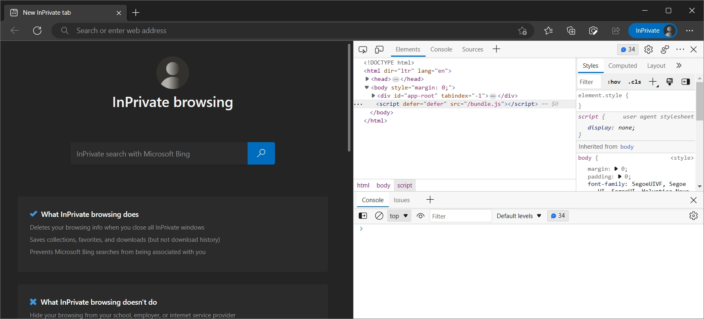
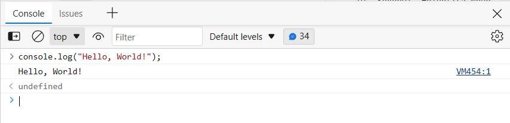
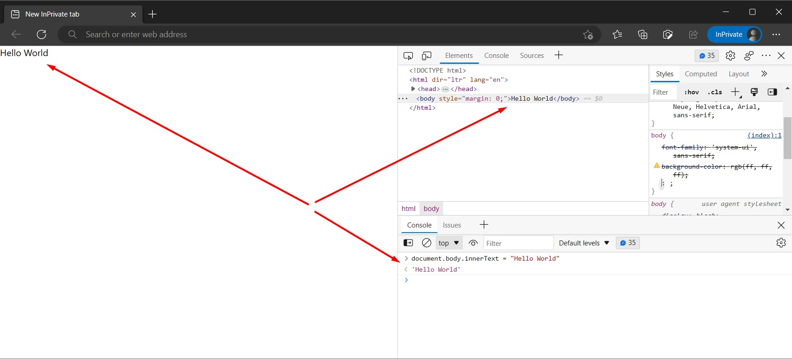
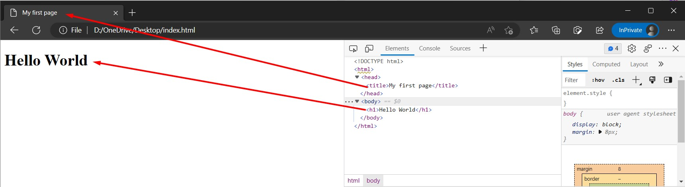
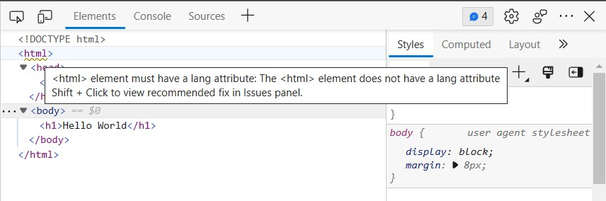
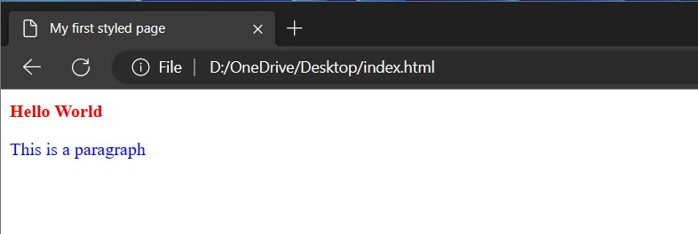

As I said in my previous post, I am going to start a series of posts about JavaScript. I will explain the basics of the language and how to use it in the browser. I will also explain the basics of the browser and how to use the developer tools.

## Getting started

JavaScript is a programming language that is used to make web pages interactive. It is the most popular programming language for web development, but not the only. JavaScript basics are easy to learn, but you will need to practice to become a good JavaScript developer. As I mentioned, to start learning JavaScript, no need to install any tools. You can start with just the browser. To be more effective developer, you'll definitely use some tools and later I'll tell about them. But to start experimenting - browser will be enough. Also, you need need to know the basics of HTML and a little of CSS.

I think the best way to learn any new thing is to do it. So, let's start with a simple example. Open your browser (I prefer [Microsoft Edge](https://www.microsoft.com/edge), but you can use any browser you like. There are differences how tools look like in different browsers, but they are neglectable). Let's open the Edge developer's tools. You can do it by pressing `F12` or right-clicking on the page and selecting "Inspect". You can also use the menu in the browser.



In the developer tools, you will see the HTML code of the page. You can also see the CSS code and the console. The console is the most important part of the developer tools. It is a place where you can write JavaScript code and see the result. Let's try it. In the console, write `js•console.log("Hello World")` and press `Enter`. You should see the text "Hello World" in the console.



JavaScript can also do math operations

```js
console.log(2 + 2);
```

But the language has been designed to manipulate the [HTML](#basics-of-html) code, and working in console is good to learn some language constructions or do some quick experiments. So, let's change some HTML. When you open browser dev tools on some page, it is associated with context of that page and the page content can be changed with the JavaScript.

```js
document.body.innerText = "Hello World";
```

The changes immediately reflected on the page and you can see the text in the console, on the page, and on the "Elements" tab.



This is example of the simplest JavaScript code. But even with this few code snippets, you can see what JavaScript can do: change the content of the page, math operations, text processing. More advanced examples will be in the next posts.

## What is the browser?

The browser is a program to display web pages. It contains of few modules:

- HTML parser - parses the HTML code and creates the DOM tree.
- CSS parser - parses the CSS code and creates the CSSOM tree.
- JavaScript engine - executes the JavaScript code.
- Rendering engine - paints the page on the screen.

The browser is a very complex program, but for now, we will not go into details. We will just use the browser to display the web pages and to use the developer tools.

## Basics of HTML

There are a lot of books and articles available on the internet to learn HTML. And to become advanced web developer I recommend to read them. But just to start, you literally need to know only few HTML tags. But first of all let's learn, what a "tag" is.

You can think of tags as of agreement between developer and browser. You as developer want to explain browser your intent, tags are the words which browser understands. Effectively, it is an instruction to browser to render (paint, display) some primitive. Tags also have attributes, which are additional information for browser to render elements with more specifics.

The most basic tags are:

- `<div>` - an abstract block element. It is used to group other elements.
- `<span>` - an abstract inline element.
- `<p>` - the more specific block element, represents paragraph of text.
- `<h1>` - the more specific block element, represents a text with heading level 1.

The are much more tags, you can learn about them on [HTML Reference](https://developer.mozilla.org/en-US/docs/Web/HTML/Element). With HTML tags you describe a page layout - the location and type of the content, without styling it.

On the screenshot above you've seen some additional tags in dev tools.

- `<html>` - the root element of the page. It contains `<head>` and `<body>` elements.
- `<head>` - the element which contains metadata about the page. It is not displayed on the page, but important for search engines.
- `<body>` - the element which contains the content of the page. It is displayed on the page.

The simplest HTML page always contains at least all these three elements. The `<head>` element contains `<title>` element, which is displayed in the browser tab. The `<body>` element contains the content of the page.

```html {numberLines}
<!DOCTYPE html>
<html>
  <head>
    <title>My first page</title>
  </head>
  <body>
    <h1>Hello World</h1>
  </body>
</html>
```

You can put this text into a file with `.html` extension and open it in the browser. You will see the page with the text "Hello World" in the browser tab.



Let's learn how to do the correct things right from the beginning. Probably you realized that `html`
tag is underlined with squiggly line. This way browser warns you that something is not correct. Hovering over the tag in dev tools helps to understand what is wrong and get a tip how to fix it.



It tells us that we missed the `lang` attribute. The `lang` attribute is used to specify the language of the page. It is important for accessibility and search engines. To have 100% correct and compliant HTML, it is good to add charset and viewport elements into `head`. So, let's add all of them.

{/* prettier-ignore-start */}
```html {numberLines, diff}
<!DOCTYPE html>
- <html>
+ <html lang="en">
  <head>
    <title>My first page</title>
+     <meta charset="utf-8" />
+     <meta name="viewport" content="width=device-width, initial-scale=1" />
  </head>
  <body>
    <h1>Hello World</h1>
  </body>
</html>
```
{/* prettier-ignore-end */}

Now the page is valid and the warning is gone. But the page still looks the same. Let's add some styling. We will use CSS for that, let's learn the basics of it.

## Basics of CSS

CSS is a language to style the HTML elements. It is a very powerful language, but for now, we will learn only the basics. The most important thing to know about CSS is that it is a declarative language. It means that you describe what you want to achieve, but not how to achieve it. The browser will do all the work for you.

To style any HTML element with CSS you need to specify the selector. The selector is a way to select the element you want to style. The most basic selectors are:

- `*` - the universal selector. It selects all elements on the page.
- `div` - the type selector. It selects all elements with the `div` tag.
- `#id` - the id selector. It selects the element with the specified id.
- `.class` - the class selector. It selects all elements with the specified class.

Selectors are also the named group of CSS rules. There are a lot of them and I'm not sure if it is possible to memoize all of them and it is not really necessary, you can always use online [CSS reference](https://developer.mozilla.org/en-US/docs/Web/CSS/Reference) for that. The most basic CSS rules are:

- `color: red;` - the color property. It sets the color of the text.
- `background-color: red;` - the background-color property. It sets the background color of the element.
- `font-size: 16px;` - the font-size property. It sets the font size of the text.
- `font-weight: bold;` - the font-weight property. It sets the font weight of the text.

There are few places where you can place CSS rules:

- `<link>` element in the `<head>` element. It is used to link the external CSS file.
- `<style>` element in the `<head>` element. It is used to style the whole page.
- `style` attribute of the element. It is used to style the specific element.

I do really recommend to use external CSS files to store your styles. It is much easier to maintain and reuse them. But for now, let's use `<style>` element, to illustrate how the elements can be styled.

```html {numberLines}
<!DOCTYPE html>
<html lang="en">
  <head>
    <title>My first styled page</title>
    <meta charset="utf-8" />
    <meta name="viewport" content="width=device-width, initial-scale=1" />
    <style>
      h1 {
        color: red;
        font-size: 16px;
      }
      .paragraphStyle {
        color: blue;
      }
    </style>
  </head>
  <body>
    <h1>Hello World</h1>
    <p class="paragraphStyle">This is a paragraph</p>
  </body>
</html>
```

In this example we select all `h1` elements and set the `color` and `font-size` properties. The `h1` element is now red and the font size is 16px. Also, we select all elements with the `paragraphStyle` class and set the `color` property. The `p` element is now blue.



One important side of CSS is ability to position elements precisely on the page and make responsive design. But this is pretty wide topic and we will learn it later. There are two modern technics to position elements on the page: [Flexbox](https://css-tricks.com/snippets/css/a-guide-to-flexbox/) and [CSS Grid](https://css-tricks.com/snippets/css/complete-guide-grid/).

## Next steps

After learning the basics, it should be enough knowledge to experiment yourself. Please visit HTML and CSS reference pages and learn HTML tags with attributes and CSS rules. Start experimenting yourself, try to replicate some popular web sites. That will help you to learn HTML and CSS faster.
