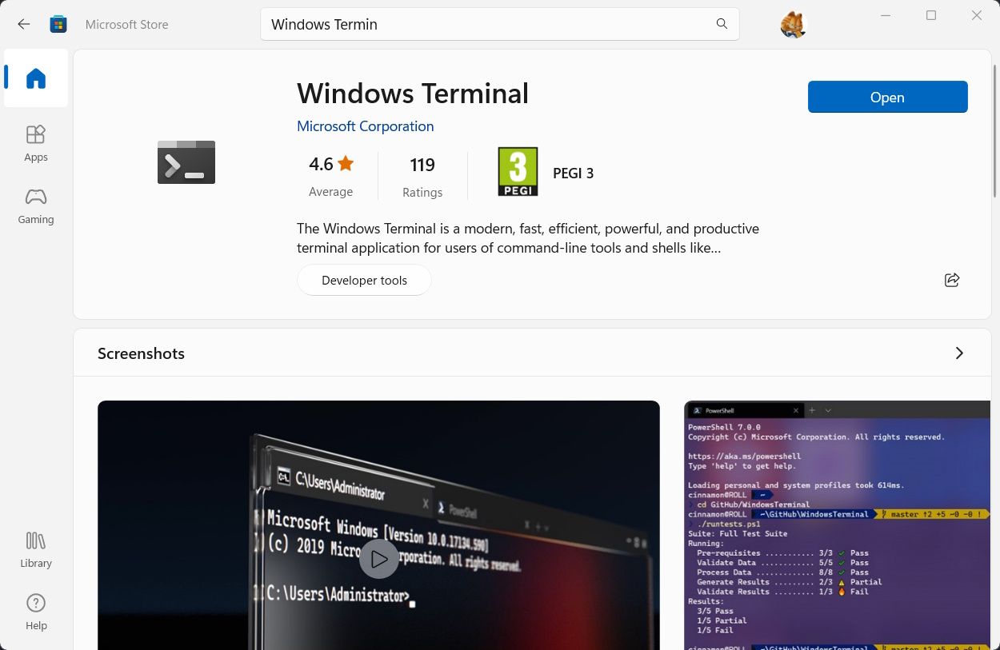

## How to Install and Configure Windows Terminal

**Windows Terminal** is a modern and customizable terminal application that allows you to run multiple command-line tools and shells in the same window. You can use Windows Terminal to run PowerShell, Command Prompt, WSL, SSH, Azure CLI, and more. In this article, I will show you how to install and configure Windows Terminal on your Windows machine.

## Install Windows Terminal from Microsoft Store

The easiest way to install Windows Terminal is to use the Microsoft Store app on your PC. To do this, follow these steps:

- Open the Microsoft Store app from the Start menu or by searching for it in the search box.
- In the search box, type "Windows Terminal" and press Enter.
- Click on the Windows Terminal app from the search results and then click on the Get button to install it.
- Wait for the installation to complete and then click on the Launch button to open Windows Terminal.

## Customize Windows Terminal Settings

Windows Terminal allows you to customize various aspects of its appearance and behavior, such as the color scheme, font size, background image, tabs, profiles, and key bindings. To access the settings - open Windows Terminal and click on the drop-down arrow next to the plus (+) sign in the title bar. Click on the Settings option from the drop-down menu. This will open a form with the configuration. There is also ability to change the settings directly in JSON file in your default text editor.

Edit the file to change any setting you want or use UI to do it, choose the method that works the best for you. I prefer to change the file and store it on OneDrive, so I can share these settings on all my devices. There are various settings to make the terminal works the best for you.

For example, you can change the default profile, which is the shell that opens when you launch Windows Terminal, by changing the value of "defaultProfile" to the GUID of your preferred profile. You can find the GUIDs of all the profiles in the "profiles" section of the file. You can also change the color scheme of each profile by changing the value of "colorScheme" to one of the predefined schemes or a custom one. You can find the predefined schemes in the "schemes" section of the file and add your own schemes there as well. And for sure supports configuration of the font size, font face, cursor shape, background image, opacity, and other settings of each profile by editing their respective properties in the "profiles" section of the file.

You can also add new profiles for different shells or command-line tools by copying and pasting an existing profile and changing its properties accordingly. For example, you can add a profile for Azure CLI by copying and pasting the PowerShell profile and changing its "name", "commandline", and "colorScheme" properties. Change the key bindings for various actions in Windows Terminal by editing the "actions" section of the file. For example, you can change the shortcut for opening a new tab by changing the value of "keys" for the action with "command": "newTab".

If the changes have been made in UI, just click "Save" button. Or if changes done to the settings file, save it and close it. The changes will take effect immediately in Windows Terminal.

## Enjoy Windows Terminal

Now that you have installed and configured Windows Terminal, you can enjoy using it to run multiple command-line tools and shells in a single window. You can switch between different tabs by clicking on them or using `Ctrl+Tab` or `Ctrl+Shift+Tab`. You can also split a tab into multiple panes by using `Alt+Shift+Plus (+)` or `Alt+Shift+Minus (-)`. There are various keyboard shortcuts to resize, move, zoom, and close tabs and panes. More information about Windows Terminal features and shortcuts is in its [official documentation](https://docs.microsoft.com/en-us/windows/terminal/).

## My configuration

If you like the look and feel of the Windows Terminal on the first picture, you can use my configuration. Just download the settings file from my [GitHub repository](https://gist.github.com/smykhailov/bba979d6c0db05c0b9c15d679c6a1e12).
