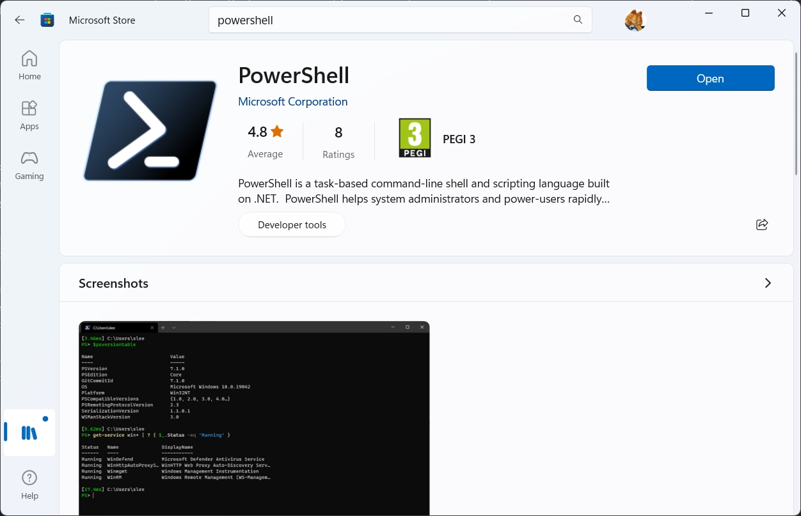

To make [Windows Terminal](/articles/configure-windows-terminal) even more effective, I recommend to install and configure [PowerShell Core](#powershell-core) and [Oh My Posh](#oh-my-posh). In this blog post, I will show you how to install and configure them.

## PowerShell Core

**PowerShell Core** is a cross-platform version of PowerShell that runs on Windows, Linux and macOS. It is based on .NET Core, a lightweight and modular framework that can be installed on different operating systems. PowerShell Core is compatible with most of the existing PowerShell modules and cmdlets, but also introduces new features and enhancements.

In this blog post, I will explore some of the benefits of using PowerShell Core for scripting and automation tasks. Here are some of the advantages of PowerShell Core over the traditional Windows PowerShell:

- **Cross-platform support**: you can use PowerShell Core to manage different types of systems and devices, such as Linux servers, IoT devices, cloud services and more. You can also write scripts that can run on multiple platforms without much modification.
- **Open source and community-driven**: PowerShell Core is an open source project that welcomes contributions from the community. You can find the [source code on GitHub](https://github.com/PowerShell/PowerShell), report issues, suggest features and even submit pull requests. You can also access a rich ecosystem of modules and tools developed by the community on the [PowerShell Gallery](https://www.powershellgallery.com/).
- **Improved performance and compatibility**: PowerShell Core leverages the performance improvements and bug fixes of .NET Core, which is faster and more reliable than the .NET Framework. PowerShell Core also supports new standards and protocols, such as SSH remoting, JSON output and REST APIs.
- **Modern development experience**: PowerShell Core supports new features and enhancements that make scripting easier and more powerful. For example, you can use classes and enums to define custom types, use ternary operators and null coalescing operators to simplify conditional expressions, use splatting to pass parameters more flexibly, and more.

PowerShell Core is not a replacement for Windows PowerShell, but a complementary tool that offers more flexibility and functionality. You can install both versions side by side on your Windows system and switch between them as needed. You can also use the Windows Compatibility Module to access Windows-specific cmdlets from PowerShell Core.

If you want to learn more about PowerShell Core and how to get started with it, you can check out the [official documentation](https://docs.microsoft.com/en-us/powershell/).

### Install PowerShell Core

There are several ways to install PowerShell Core on your system. You can [download the latest MSI package](https://github.com/PowerShell/PowerShell/releases) from the official website and run it to install PowerShell Core. You can also use a package manager, such as Scoop, Chocolatey or Homebrew, to install PowerShell Core. If you are on Linux, you can use a package manager or download the tar.gz package from the official website and extract it to a folder that is in your PATH environment variable. On windows I recommend to install it from Microsoft Store, as it will get automatic updates.



### Configure PowerShell Core

Once you have installed PowerShell Core, you can start using it to run scripts and commands. You can also configure PowerShell Core to customize the user experience and make it more productive. Here are some of the configuration options that you can set:

- **Execution policy**: the execution policy determines the conditions under which PowerShell scripts can be run. You can set the execution policy to `Restricted`, `AllSigned`, `RemoteSigned`, `Unrestricted` or `Bypass`. The default execution policy is `Restricted`, which means that PowerShell scripts cannot be run unless they are signed by a trusted publisher. You can set the execution policy by running the `Set-ExecutionPolicy` cmdlet.
- **Prompt**: The prompt is the text that is displayed in the command-line window to indicate that PowerShell is ready to accept input. You can customize the prompt by setting the `$PSDefaultParameterValues` variable. For example, you can set the prompt to display the current directory and the current time by running the following command:

```powershell
$PSDefaultParameterValues = @{ "prompt": "`n{0} {1} {2} " }
```

- **Aliases**: PowerShell aliases are short names for cmdlets and functions. You can create aliases for frequently used commands to make them easier to type. For example, you can create an alias for the `Get-ChildItem` cmdlet by running the following command:

```powershell
New-Alias ls Get-ChildItem
```

- **Modules**: PowerShell modules are collections of cmdlets, functions, scripts and other resources that can be used to perform specific tasks. You can import modules to make their cmdlets and functions available in the current session. For example, you can import the `Microsoft.PowerShell.Utility` module by running the following command:

```powershell
Import-Module Microsoft.PowerShell.Utility
```

- **Profiles**: PowerShell profiles are scripts that are executed when PowerShell starts. You can use profiles to customize the user experience and make it more productive. For example, you can use a profile to set the execution policy, import modules, create aliases, and more. You can create a profile by running the `New-Item` cmdlet and specifying the path to the profile file. For example, you can create a profile for the current user by running the following command:

```powershell
New-Item -Path $PROFILE -ItemType File -Force
```

Or you can use Oh My Posh to customize your prompt. Here is details about it.

## Oh My Posh

[Oh My Posh](https://ohmyposh.dev/) is a tool that allows you to customize your command-line prompt with various themes and segments. It works with any shell and terminal emulator, such as PowerShell, Bash, Zsh, Windows Terminal, iTerm2, Hyper, etc. In this blog post, I will give you an overview of how to install and use Oh My Posh to make your command-line experience more enjoyable and productive.

### Installation

The easiest way to install Oh My Posh is to use a package manager. For example, if you are on Windows and use Scoop or Chocolatey, you can run the following commands:

Scoop:

```bash
scoop install oh-my-posh
```

Chocolatey:

```bash
choco install oh-my-posh
```

If you are on macOS and use Homebrew, you can run:

```bash
brew tap jandedobbeleer/oh-my-posh
brew install oh-my-posh
```

If you are on Linux and use Snap, you can run:

```bash
sudo snap install oh-my-posh --classic
```

Alternatively, you can download the binary file from the GitHub releases page and place it in a folder that is in your PATH environment variable.

### Configuration

Once you have installed Oh My Posh, you need to configure your shell to use it as the prompt engine. This involves creating a configuration file that defines the theme and segments you want to display, and sourcing it from your shell profile file. The configuration file can be in JSON or YAML format, and it has the following structure:

```json
{
  "final_space": true,
  "console_title": true,
  "console_title_style": "template",
  "console_title_template": "{{ .Shell }} in {{ .Folder }}",
  "blocks": [
    {
      "type": "prompt",
      "alignment": "left",
      "segments": [
        // segments for the left prompt
      ]
    },
    {
      "type": "prompt",
      "alignment": "right",
      "segments": [
        // segments for the right prompt
      ]
    }
  ]
}
```

You can find the documentation for each configuration option and segment on the [official website](https://ohmyposh.dev/docs/).

You can also use one of the predefined themes that come with Oh My Posh. They available in the `themes` folder of the installation directory, or on the [themes section](https://ohmyposh.dev/docs/themes) on the official website.

To use a theme, you just need to specify its name in your shell profile file. For example, if you want to use the `jandedobbeleer` theme in PowerShell, you can add the following line to your `$PROFILE` file:

```powershell
oh-my-posh --init --shell pwsh --config $HOME\.poshthemes\jandedobbeleer.omp.json | Invoke-Expression
```

If you want to use the same theme in Bash, you can add the following line to your `.bashrc` file:

```bash
eval "$(oh-my-posh --init --shell bash --config ~/.poshthemes/jandedobbeleer.omp.json)"
```

You can also create your own theme by copying and modifying an existing one, or starting from scratch.

### Usage

Once you have configured Oh My Posh, you can enjoy your new and improved command-line prompt. You will see different segments that show useful information about your current session, such as your username, hostname, current directory, git status, time, battery level, etc. You can also customize the colors, icons, fonts, and spacing of each segment to suit your preferences.

Oh My Posh also supports various features that enhance your productivity and convenience. For example:

- You can toggle the visibility of certain segments by setting environment variables. For example, if you want to hide the git segment temporarily, you can run `export OMP_HIDE_GIT=1` in Bash or `$env:OMP_HIDE_GIT=1` in PowerShell.
- You can use different themes for different shells or directories by setting aliases or functions. For example, if you want to use a different theme for PowerShell Core, you can add this function to your `$PROFILE` file:

```powershell
function Set-PoshPrompt {
  if ($PSVersionTable.PSEdition -eq 'Core') {
    oh-my-posh --init --shell pwsh --config $HOME\.poshthemes\paradox.omp.json | Invoke-Expression
  } else {
    oh-my-posh --init --shell pwsh --config $HOME\.poshthemes\jandedobbeleer.omp.json | Invoke-Expression
  }
}
```

### Fonts

To display all the icons and symbols in your prompt, you need to use a font that supports [Nerd Fonts](https://www.nerdfonts.com/). You can find a list of fonts that support Nerd Fonts on the [official website](https://www.nerdfonts.com/font-downloads). You can also use the [Nerd Fonts patcher](https://www.nerdfonts.com/patcher) to patch your favorite font. I use patched [Meslo font](https://github.com/ryanoasis/nerd-fonts/tree/master/patched-fonts/Meslo) for my PowerShell prompt.

### Conclusion

Oh My Posh is a powerful and flexible tool that can enhance your command-line experience with beautiful and informative prompts. It supports many shells and terminals and offers many themes and customization options. In this blog post, I showed you how to install and configure Oh My Posh for basic usage. If you want to learn more about Oh My Posh and its features, you can visit its website or [GitHub repository](https://github.com/jandedobbeleer/oh-my-posh).
