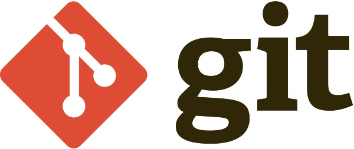

Developing JavaScript applications with just a browser sounds tempting, but it's not enough. You need some tools to boost your productivity and simplify your workflow. In this article, I will introduce the tools that you might find indispensable in your daily work.

After setting up [Windows Terminal](/articles/configure-windows-terminal) and [PowerShell](/articles/pscore-ohmyposh), you are ready to install other tools that will enhance your experience.

## Node.js


The first tool in your tool-belt should be [Node.js](https://nodejs.org/). It is a popular and powerful JavaScript runtime environment that allows you to run JavaScript code outside of a web browser. In this section, I will give you an overview of what Node.js is, how it works, and why you should use it for your next web development project.

Node.js is an open-source, cross-platform software that executes JavaScript code on a server. It was created in 2009 by Ryan Dahl, who was inspired by the event-driven and non-blocking I/O model of Google Chrome's V8 engine (in one of the future posts, I'll explain what V8 engine is and why it directories). Node.js uses the same V8 engine to run JavaScript code, but with some additional features and modules that make it suitable for server-side development or to execute different console tools, which are very useful to develop other applications.

It has many advantages that make it a great choice for web development. Some of them are:

- It is fast and scalable. Node.js can handle a large number of concurrent connections and requests with minimal overhead, thanks to its non-blocking I/O model and single-threaded architecture. It also supports clustering and load balancing to distribute the workload among multiple processes or machines.
- It is easy and fun to use. Node.js allows you to use JavaScript for both front-end and back-end development, which means you can use the same language and tools for the entire web stack. It also has a rich and vibrant ecosystem of modules and frameworks that you can use to build any kind of web application you can imagine.
- It is versatile and adaptable. Node.js can be used for a wide range of web applications, such as real-time communication, streaming media, data analysis, e-commerce, gaming, IoT, etc. It also supports various protocols and formats, such as HTTP, WebSocket, JSON, XML, etc.

You can download and install latest [Node.js version](https://nodejs.org/en/download/) from the official website. But I recommend to install it using [nvm](#node-version-manager-nvm) (Node Version Manager), which allows you to install and manage multiple Node.js versions on your machine.

## Node package manager (npm)


npm is a popular tool for JavaScript development that allows you to publish and install packages from the public npm registry or a private npm registry. npm stands for Node Package Manager, and it is the default package manager for Node.js, a JavaScript runtime environment.

npm has two main components: the npm command line interface (CLI) and the npm registry. The npm CLI is a program that you can use to interact with npm from your [terminal](/articles/configure-windows-terminal). You can use it to create, publish, update, and delete packages, as well as to manage dependencies and run scripts. The [npm registry](https://www.npmjs.com/) is a large database of JavaScript packages that you can access through the npm CLI or through a web browser.

To use npm, you need to [install Node.js](#nodejs) and the npm CLI on your system. You can do this using either a [Node version manager](#node-version-manager-nvm) or a [Node installer](https://nodejs.org/en/download).

## Node version manager (nvm)


A Node version manager lets you install and switch between multiple versions of Node.js and npm, which is useful for testing your applications on different versions. A Node installer lets you install a specific version of Node.js and npm with a single program.

Here you can find instructions how to install Node.js and npm using a Node version manager also called nvm. nvm is available for MacOS, Linux, and Windows systems. To install nvm, follow the instructions on its official website: [MacOS, Linux](https://github.com/nvm-sh/nvm) and [Windows](https://github.com/coreybutler/nvm-windows).

After installing nvm, you can use it to install any version of [Node.js](#nodejs) and [npm](#node-package-manager-npm) that you want. For example, to install the latest LTS (Long Term Support) version of Node.js and npm, run the following command:

```shell
nvm install --lts
```

To check the installed version of Node.js and npm, run the following commands:

```shell
node -v
npm -v
```

You can also use nvm to switch between different versions of Node.js and npm that you have installed. For example, to switch to version 14.18.2 of Node.js and npm, run the following command:

```shell
nvm use 14.18.2
```

To see all the versions of Node.js and npm that you have installed, run the following command:

```bash
nvm ls
```

## Git



Git is a popular version control system that allows you to track changes in your code and collaborate with other developers. It is widely used in software development and open source projects.

Git is based on the concept of a repository, which is a collection of files and folders that are associated with a project. A repository can have multiple branches, which are different versions of the project that can be created, modified, and merged. Each branch has a series of commits, which are snapshots of the project at a certain point in time. You can use git commands to create, switch, merge, and delete branches, as well as to add, edit, delete, and revert files.

To install git on your computer, you need to download ans install the appropriate package for your operating system from the [official website](https://git-scm.com/downloads). To verify that git is installed correctly, open a terminal or command prompt and type:

```bash
git --version
```

This should display the version number of git that you have installed.

Once you have installed git, you can start using it to create and manage your own repositories. You can also use git to clone existing repositories from remote sources, such as [GitHub](https://github.com/) or [Bitbucket](https://bitbucket.org/). To learn more about git and its features, visit the [official documentation](https://git-scm.com/doc) or some [online tutorials](https://www.atlassian.com/git/tutorials).

## IDEs

If you are a web developer, you probably know how important it is to have a good integrated development environment (IDE) for your projects. An IDE is a software application that provides comprehensive facilities to computer programmers for software development. An IDE normally consists of a source code editor, a compiler or interpreter, a debugger, and other tools for code completion, syntax highlighting, refactoring, and testing.

There are many IDEs available for web development, each with its own features and advantages. Here is the list of the most popular ones. These are just some of the IDEs that you can use for web development. Depending on your preferences and needs, you may find one of them more suitable for your projects. However, you can also try out different IDEs and see which one works best for you. My personal favorite is Visual Studio Code.

### Visual Studio Code


[Visual Studio Code](https://code.visualstudio.com/) (VS Code) is a free and open-source IDE developed by Microsoft. It supports a wide range of programming languages, frameworks, and technologies for web development, such as HTML, CSS, JavaScript, TypeScript, React, Angular, Vue, Node.js, PHP, Python, Ruby, and more. VS Code has a rich set of extensions that enhance its functionality and provide features such as code completion, syntax highlighting, debugging, testing, formatting, refactoring, and more. VS Code also has a built-in terminal, a source control integration, and a live server that allows you to preview your web pages in real time.

### WebStorm


[WebStorm](https://www.jetbrains.com/webstorm/) is commercial but powerful and professional IDE developed by JetBrains. It is designed specifically for web development and supports many languages and frameworks such as JavaScript, TypeScript, HTML, CSS, React, Angular, Vue, Node.js, Express, Meteor, Django, Laravel, WordPress, and more. WebStorm has many advanced features that help you write high-quality code and boost your productivity. Some of these features are code analysis, code completion, refactoring, debugging, testing, code formatting, code generation, live editing, and more. WebStorm also integrates with many tools and services such as Git, GitHub, npm, Yarn, webpack, ESLint, Prettier, Jest, Mocha, Karma, and more.

### Sublime Text


[Sublime Text](https://www.sublimetext.com/) is a across-platform text editor that can be used as an IDE with the help of plugins. It is known for its speed, simplicity, and elegance. It supports many languages and frameworks for web development. It has features such as multiple cursors, split editing, distraction-free mode, and a powerful command palette.
