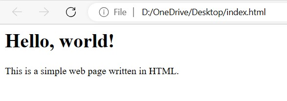
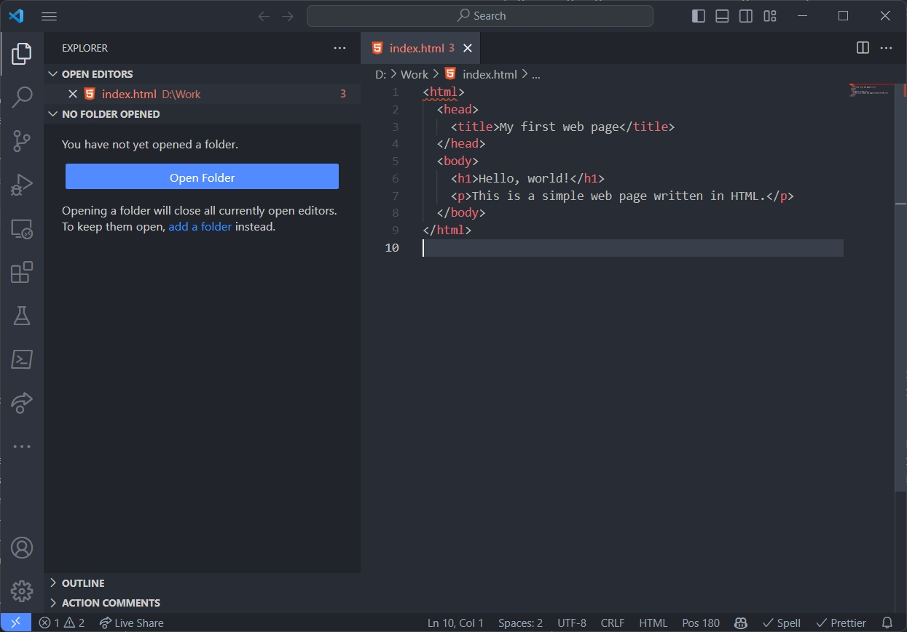
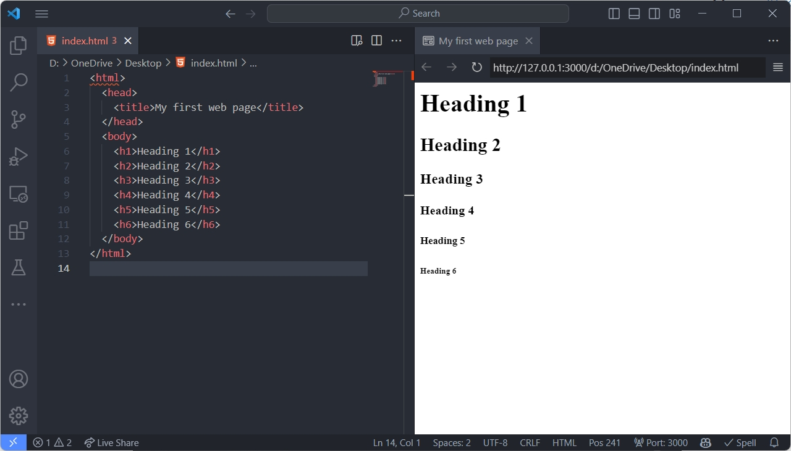
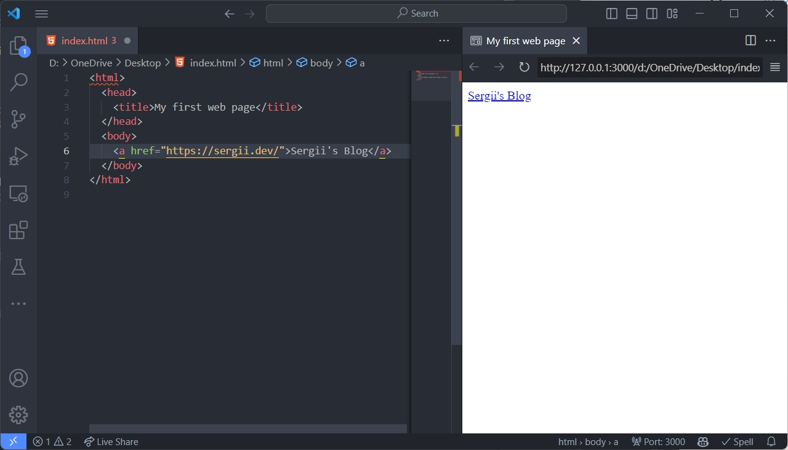
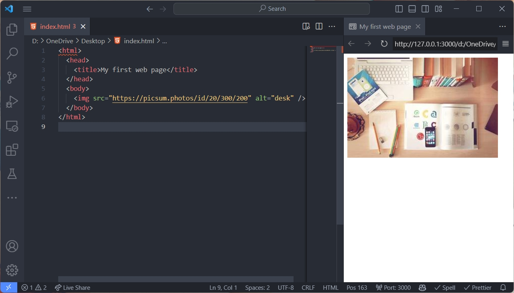

After [dev environment setup](/articles/web-dev-tools), the first thing you need to learn is HTML. HTML is the language that is used to create the skeleton of a web page. It is the first thing that you need to learn to start your web development journey.

## HTML Overview

HTML stands for HyperText Markup Language. It is the standard language for creating web pages and web applications. HTML describes the structure and content of a web page using tags and attributes. Tags are keywords enclosed in angle brackets (`<` and `>`) that define how the content should be displayed. Attributes are additional information that modify the behavior or appearance of a tag.

For example, the following HTML code defines a web page with a title, a heading and a paragraph:

```html
<html>
  <head>
    <title>My first web page</title>
  </head>
  <body>
    <h1>Hello, world!</h1>
    <p>This is a simple web page written in HTML.</p>
  </body>
</html>
```

The result of the above code will look the following way:



The `<html>` tag indicates the start and end of the HTML document. The `<head>` tag contains information about the web page, such as the `<title>` tag that defines the title of the web page. The `<body>` tag contains the main content of the web page, such as the `<h1>` tag that defines a heading and the `<p>` tag that defines a paragraph.

Now, experiment yourself. Open your favorite [IDE](/articles/web-dev-tools/#ides) and create a file with the `.html` extension. Copy the above code and paste it into the editor. Save the file and open it in your browser directly from the place you saved it. You can double-click on the file to open it with default browser. Your first HTML page is ready, it's time to celebrate that little victory!



But we are running to fast. First of all we need to understand what is a tag and what is an attribute.

## HTML Tags and Attributes

If you are new to web development, you might wonder what an HTML tag is and how it works. Let's get to the basics of HTML tags.

An HTML tag is a piece of markup language that indicates the start and end of an HTML element in a web page. An HTML element is a part of the web page content that can be formatted and displayed by a web browser. For example, the `<p>` tag is used to create a paragraph element, and the `` tag is used to insert an image element.

An HTML tag usually consists of an opening tag and a closing tag, with the content of the element in between. The opening tag has the name of the element inside angle brackets - `<tag_name>`. The closing tag has the same name with a slash before it - `</tag_name>`. Some tags, such as ``, do not have a closing tag and are called self-closing tags. And you should specify the slash before the closing angle bracket - ``.

The following diagram shows how tags are used in HTML elements:

```html
<tag_name> content </tag_name>
```

Some tags have attributes that provide additional information about the element. An HTML attribute is a modifier of an HTML element that provides additional information about the element or changes its behavior in some way. Attributes are specified inside the start tag of an element, after the element name, and have the form of `name="value"` pairs.

For example, in the following HTML code, the `` element has three attributes: `src`, `alt`, and `width`.

```html

```

The `src` attribute specifies the source URL of the image file to display. The `alt` attribute provides an alternative text for the image in case it cannot be loaded or displayed. The `width` attribute sets the width of the image in pixels.

HTML attributes are an essential part of HTML, as they allow web developers to customize and enhance their web pages and web applications. By using HTML attributes, you can create more interactive and user-friendly web experiences.

## HTML Document Structure

An HTML document is a text file that contains HTML tags and attributes. It is the basic building block of a web page. An HTML document is composed of four major parts: the document type declaration, the `<html>` element, and the `<head>` and `<body>` elements. This is the minimal set of elements that you need to create a valid HTML document.

The `head` element contains information about the web page, such as the title of the page, the character encoding, and the metadata. The `body` element contains the main content of the web page, such as text, images, and links.

## Fundamental HTML Tags

By learning only few of the fundamental HTML tags it is possible to create a simple web page, but not web application (I'll explain the difference in one of the following articles).

### `<html>`

The `<html>` tag is the root element of an HTML document. It is the **container** for all other HTML elements. You should always define the `<html>` tag at the beginning of an HTML document.

### `<head>`

The `<head>` tag is **container** element used to define the head section of an HTML document. The head section contains information about the web page, such as the title of the page, the character encoding, and the metadata. Everything added inside the `<head>` tag is not displayed on the web page, but it adds additional instructions for browser to understand the structure and dependencies of the web page.

### `<body>`

The `<body>` tag is also **container** element used to define the body section of an HTML document. The body section contains the main content of the web page, such as text, images, and links. Everything added inside the `<body>` tag is displayed on the web page.

### `<h1>`, `<h2>`, `<h3>`, `<h4>`, `<h5>`, `<h6>`

The `<h1>`, `<h2>`, `<h3>`, `<h4>`, `<h5>`, and `<h6>` tags are used to define headings in an HTML document. The `<h1>` tag is the most important heading, and the `<h6>` tag is the least important heading. The heading tags are visible on the page



### `<p>`

The `<p>` tag is used to define a paragraph in an HTML document.


### `div`

The `<div>` is **block container** tag and used to define a division or a section in an HTML document. Block container means that it takes the whole width of the page and starts from a new line. The `<div>` tag is invisible element.

### `<span>`

The `<span>` is **inline container** tag is used to define a section in an HTML document. Inline container means that it takes only the width of the content and does not start from a new line. The `<span>` tag is also invisible element.

### `<a>`

The `<a>` tag is used to define a hyperlink in an HTML document. It requires the `href` attribute, which indicates the link's destination. The `href` attribute can contain either an absolute or a relative (to the current page) URL.



### ``

The `` tag is used to define an image in an HTML document. The `src` attribute is required, which specifies the path to the image file. The `alt` attribute is optional and specifies an alternative text for the image. The `alt` attribute is used if the image cannot be displayed. I recommend to add it always to improve accessibility of your web page.



## Summary

These are just starting point, I described only few of the HTML elements and even less attributes. But it is already enough to start creating simple web pages. HTML specification contains much more tags and attributes, I'm not going to describe all of them, as there are a loot of references already created on the internet. The best source of information is [MDN Web Docs](https://developer.mozilla.org/en-US/docs/Web/HTML/Reference). When you become familiar with basics, you can gradually start learning more of the elements when you need them. Start practicing - more practice brings more questions and more observations. Be curios, experiment, read other resources. And don't forget to have fun!
