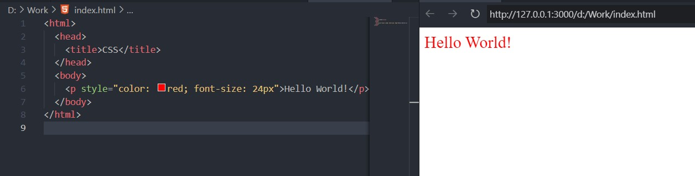
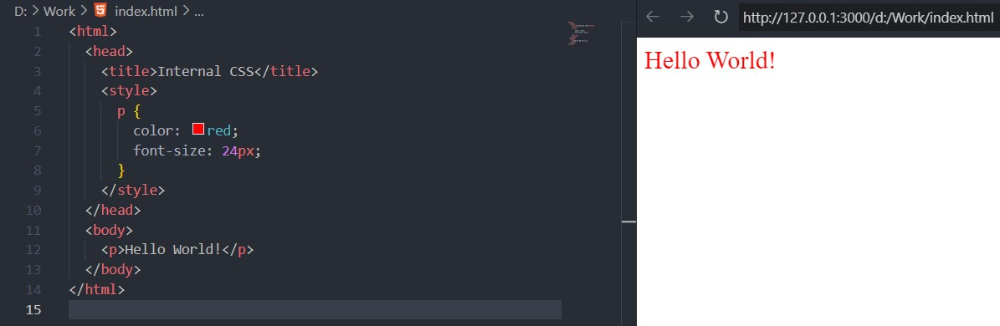
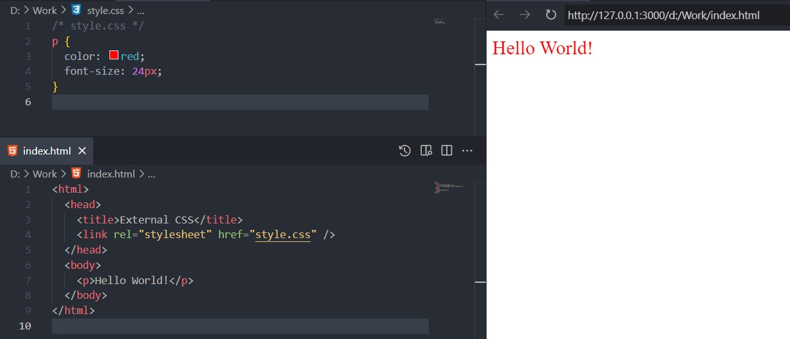

The natural continuation in learning web technologies goes with CSS. [HTML](/articles/html-minimum-required-knowledge) instructs browser what and where to display, but CSS is responsible for the look and feel of the web page. It is the language that describes the style of an HTML document. CSS describes how HTML elements should be displayed. This article will cover the minimum required knowledge to start working with CSS.

## CSS Overview

CSS stands for Cascading Style Sheets. It is a language that defines how HTML elements are displayed on a web page. CSS can control the layout, colors, fonts, animations, transitions, and other aspects of the presentation layer of a web page.

CSS works by applying rules to HTML elements that match certain selectors. A selector can be an element name, a class name, an id, an attribute, or a combination of these. A rule consists of a selector and a declaration block. A declaration block contains one or more declarations that specify the properties and values for the selected elements.

For example, the following CSS rule applies a `red color` and a `24px` font size to **all** paragraphs on a web page:

```css
p {
  color: red;
  font-size: 24px;
}
```

CSS can be written in three ways: inline, internal, or external.

### Inline CSS

Inline CSS is written inside the style attribute of an HTML element.

```html
<p style="color: red; font-size: 24px;">Hello World!</p>
```

And the result looks the following:



### Internal CSS

Internal CSS is written inside the style element in the head section of an HTML document.

```html
<html>
  <head>
    <title>Internal CSS</title>
    <style>
      p {
        color: red;
        font-size: 24px;
      }
    </style>
  </head>
  <body>
    <p>Hello World!</p>
  </body>
</html>
```

And the result looks the same:



### External CSS

External CSS is written in a separate file with a `.css` extension and linked to an HTML document using the link element.

```html
<html>
  <head>
    <title>External CSS</title>
    <link rel="stylesheet" href="style.css" />
  </head>
  <body>
    <p>Hello World!</p>
  </body>
</html>
```

```css
/* style.css */
p {
  color: red;
  font-size: 24px;
}
```

Not surprizing, the result looks the same:



Inline CSS has the highest specificity and overrides any other CSS rules that apply to the same element. External CSS has the lowest specificity and can be overridden by any other CSS rules. Internal CSS has a medium specificity and can override external CSS but not inline CSS.

CSS is a powerful and flexible language that can enhance the appearance and usability of web pages. However, it also has some limitations and challenges. For example, CSS does not have variables, functions, or loops that can make writing and maintaining code easier. CSS also does not have native support for responsive design, which means adapting the layout and content of web pages to different screen sizes and devices. To overcome these limitations and challenges, developers can use preprocessors like [Sass](https://sass-lang.com/) or [Less](https://lesscss.org/) that extend the features of CSS or frameworks like [Bootstrap](https://getbootstrap.com/) or [Tailwind](https://tailwindcss.com/) that provide ready-made components and utilities for responsive design.

## CSS Selectors

CSS selectors are patterns that allow us to select HTML elements and apply styles to them.

### Type selector

This selector matches all elements that have the same tag name. For example, `p` selects all paragraph elements in the document.

```css
/* Type selector */
p {
  font-family: Arial;
}
```

### Class selector

This selector matches all elements that have a specific class attribute. For example, `.green-text` selects all elements with `class="green-text"`.

```css
/* Class selector  */
.green-text {
  color: green;
}
```

### ID selector

This selector matches an element that has a unique ID attribute. For example, `#logo` selects the element with `id="logo"`.

```css
/* ID selector */
#logo {
  width: 100px;
}
```

### Attribute selector

This selector matches elements that have a certain attribute or attribute value. For example, `[href]` selects all elements that have an `href` attribute, and `[href^="https"]` selects all elements that have an `href` attribute that starts with "https".

```css
/* Attribute selector */
[href] {
  text-decoration: none;
}
```

### Pseudo-class selector

This selector matches elements based on their state or position. For example, `:hover` selects elements when the mouse pointer is over them, and `:first-child` selects elements that are the first child of their parent.

```css
/* Pseudo-class selector  */
a:hover {
  color: green;
}
```

### Pseudo-element selector

This selector matches a part of an element or a generated content. For example, `::before` inserts content before an element, and `::first-line` selects the first line of a block element.

```css
/* Pseudo-element selector */
p::first-line {
  font-weight: bold;
}
```

### Combinator selector

This selector combines two or more selectors to create a more specific selection. For example, `div p` selects all paragraph elements that are descendants of a `div` element, and `h1 + p` selects all paragraph elements that are immediately after an `h1` element.

The example below uses the child combinator `(>)` to select all `<li>` elements that are direct children of a `<ul>` element with a class of `.menu`. The child combinator ensures that only the top-level list items are selected, not the nested ones.

```css
ul.menu > li {
  font-weight: bold;
  color: blue;
}
```

This selector will apply the style to the list items marked with an asterisk `(*)` in the following HTML:

```html
<ul class="menu">
  <li>* Home</li>
  <li>
    * About
    <ul>
      <li>Our mission</li>
      <li>Our team</li>
    </ul>
  </li>
  <li>* Contact</li>
</ul>
```

## CSS properties

One of the main concepts in CSS is the property. A property is a name-value pair that specifies an aspect of an element's appearance or behavior. For example, the color property sets the text color of an element, and the display property determines how an element is rendered on the page.

There are hundreds of CSS properties that can be used to style web pages. Some of the most common ones are:

- `background` - sets the background color or image of an element
- `border` - sets the width, style and color of the element's border
- `font-family` - sets the font typeface of the element's text
- `font-size` - sets the font size of the element's text
- `margin` - sets the space outside the element's border
- `padding` - sets the space inside the element's border
- `position` - sets the position of an element relative to its parent or the viewport
- `width` and `height` - set the dimensions of an element

To use a CSS property, you need to write a selector that matches the element you want to style, followed by a declaration block that contains one or more property-value pairs. For example:

```css
p {
  color: blue;
  font-size: 16px;
}
```

This CSS rule applies to all `<p>` elements on the page and sets their text color to blue and their font size to `16px`.

CSS properties can be grouped into categories based on their function or purpose. Some of these categories are:

- **Box model**: properties that affect the size and spacing of an element's box, such as margin, padding, border, width and height
- **Typography**: properties that affect the appearance and layout of text, such as font-family, font-size, color, text-align and line-height
- **Background and border**: properties that affect the background and border of an element, such as background-color, background-image, border-style and border-radius
- **Positioning and layout**: properties that affect how elements are positioned and arranged on the page, such as position, display, float and flex
- **Transforms and animations**: properties that enable dynamic effects on elements, such as transform, transition and animation

CSS properties are powerful tools that can help you create beautiful and responsive web pages. To learn more about CSS properties and how to use them, you can visit on [MDN](https://developer.mozilla.org/en-US/docs/Web/CSS/Reference).

## Summary

So, today we learned that CSS is a language that defines how HTML elements are displayed on a web page. CSS can control the layout, colors, fonts, animations, and other aspects of the visual presentation. CSS can also make web pages responsive to different screen sizes and devices. CSS is one of the core technologies of web development, along with HTML and JavaScript.
