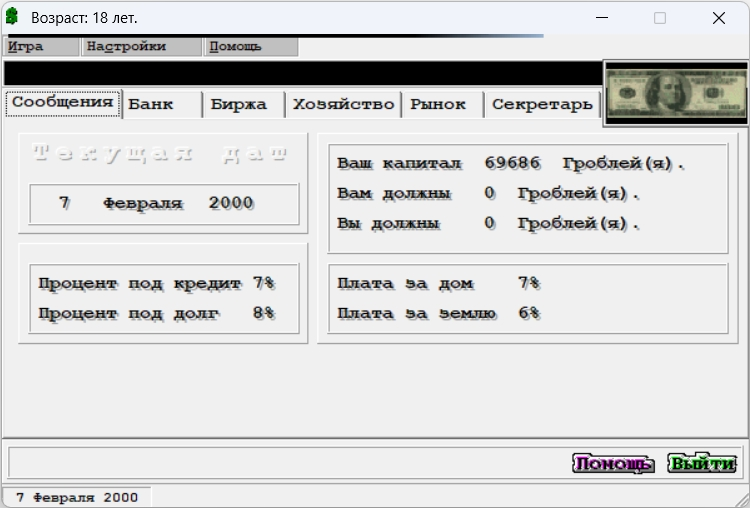

The best way to learn a new technology or programming language is to create something with it. I thought for a long time which project I can propose to start with. And I decided not to invent something new, but rather return back to my teenage years and create a game. I have chosen a game that I played a lot in my childhood. It is called "Businessman" (Коммерсантъ). The goal of the game is to become the richest player by buying and selling properties. The game is over when one player becomes bankrupt. The game is very simple and I think it is a good start for a beginner. That was my first project, I learned two programming languages by implementing this game with them. First language was Pascal and the next one, was logical continuation of it - Delphi. Unfortunately, I lost the Pascal version of the code, but I still have Delphi version, both [executable](https://github.com/smykhailov/businessman/releases/download/v1.0/Bussinessman.exe) and [source code](https://github.com/smykhailov/businessman).

I created it when I was 18 and didn't know English well, so the filenames and classes are partially named as transliteration. The game has been implemented with Delphi v3 or v4 with a lot of custom components, so I'm afraid it will not be possible to find all of them easily and compile the code. But you can download binary and play it 😄.

## The original Коммерсантъ

"Коммерсантъ" is an economic strategy game in which events occur in real-time but pause to wait for the user's reaction. The player takes on the role of a merchant whose goal is to increase wealth through commercial operations such as buying and selling, depositing and borrowing funds from the bank, purchasing from dubious individuals at a reduced price, concluding various deals and so on. The game begins on January 1, 2000 when the player has a car, a house, a small amount of land and oil, as well as some money in an account (in a currency called "grobly").

If the player does nothing during the game, time passes (one day in several seconds) and various events may occur that require the player's reaction. During the waiting period, the player can find out from the secretary the state of affairs, go to the bank, market, or visit the stock exchange. In the bank, you can both take out a loan and lend at interest. In a merchant's economy, there may be two types of goods - oil and land. Each of them can be bought or sold on the stock exchange. At the same time, oil is required for heating a house, and accordingly, some of its reserves are needed; an unheated house creates the probability that a merchant will get sick and end up in a hospital. Land is taxed and therefore at the end of the month for its ownership, a bill is issued to the player for payment. Each of the goods can change its price once a month on the stock exchange, and thus a merchant can choose moments when they are cheap to buy and expensive to sell. At the same time, random events may occur (for example, bankruptcy of oil companies), which can change the price of goods many times over. At the same time, if a player has goods in stock, then they are subject to the risk of random events (for example, a fire at an oil storage facility can destroy property). Also, land and oil can only be purchased until there is at least one unit of purchased goods in stock. In case of bankruptcy, goods are sold for a third of their price until they run out or until the balance becomes positive. Also, nothing can be bought if there will be less than one grobly on balance after that.

The gameplay is divided into periods of one year, at the end of each of which the player's result is recorded in the table of the best merchants for the corresponding year. In the case of a multiplayer game mode, which is implemented as hotseat, players change at the end of each year. The game is divided into months, at the end of each of which a balance is drawn up for all operations during the past month, and if it is positive, the tax inspection withdraws the amount of tax according to the current percentage. Interest rates change over time according to random events (orders from the district executive committee, decrees of the president, and so on).

Random events can be of several types. These are one-time events that change some indicators (OMON takes the player's car, the bank goes bankrupt, etc.). A chain of events - for example, the character's wife is kidnapped by bandits and a ransom is demanded, and an investigation can be started that lasts several months and consists of a series of one-time events. Visiting a restaurant not only gives a chance to conclude profitable deals but also has a chance to get poisoned, which leads to staying in the hospital without the possibility of doing anything and paying for treatment upon completion; and if the player does not sell stolen oil quickly, then the police may go after them. The third type is built-in mini-games: a racetrack and a casino. In the first one, the player can bet on horses and watch the competition. In the second one, the player is given the opportunity to play roulette or one-armed bandit. In any case, if bankruptcy occurs and the balance remains negative, this is a loss.

The original version of this game has been written by Ukrainian programmer [Volodymyr Kharchenko](https://uk.wikipedia.org/wiki/Харченко_Володимир_Анатолійович) and distributed as a freeware software.

## The Businessman (Commersant) project

I propose to re-implement this game again, but with a different technology set:

- Pure JavaScript (no any framework)
- Pure [HTML](/articles/html-minimum-required-knowledge)
- Pure [css](/articles/css-minimum-required-knowledge)

We will also use [Web Developer's Tools](/articles/web-dev-tools/), [Git and GitHub](/articles/git-and-github-minimum-required-knowledge/).

In the next articles, we will create a game step by step. I will try to explain all the steps in detail, so it will be easy to follow. Stay tuned!
