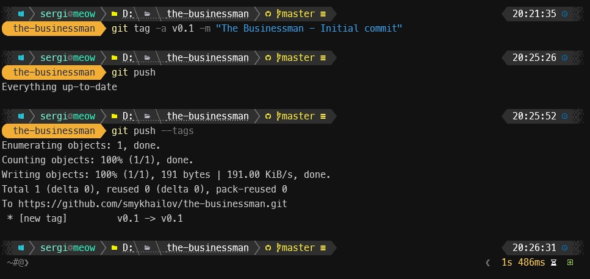

So, it is time to start the real codding work. As I proposed on the previous post, we are going to implement a game - [The Businessman](./articles/the-businessman-commersant-project). The project will be implemented in vanilla technologies - HTML, CSS and JavaScript. No framework, no bundlers, no transpilers. Just plain old technologies. This will help to understand basics and prepare platform and gain necessary knowledge for future transition to most advanced technologies, frameworks and abstractions. This approach will also help to understand why and how different technologies and framework appeared and what problems they were solving and how they simplify (or sometimes complicates 😄) different aspects of web development.

## Create repository

First of all you need to register your account on [GitHub](https://github.com/) if you donn't have it yet. Then you need to create a new repository. You can do it by clicking on the `+` button in the top right corner of the page and selecting `New repository` from the dropdown menu.

I'll do the same to show the entire process from the beginning. Let's see how to do it. First of all, you need to click on the `+` button in the top right corner of the page and select `New repository` from the dropdown menu, or go directly to the page where you can create a [new repository](https://github.com/new).


I'm creating the new `the-businessman` repository under my `smykhailov` account with description as a public repository. I also added a `README.md` file with the description of the project. I'm not going to add any other files at this point. I'll do it later. I also added MIT license to the project. You can read more about [open source licenses](https://opensource.org/licenses) on the [opensource.org](https://opensource.org/) website. Also, I added `.gitignore`, this file allows to specify what files and folders should be ignored by git. I'm using template for `Node` project as it is closest to what are we going to do. But I'll modify it later to add/remove some additional files and folders to be ignored. After I pressed `Create repository` button, I got the repository create, published and [available](https://github.com/smykhailov/the-businessman) for everyone.

## Clone the repository

Now I can clone the repository to my local folder. There are few ways how to do it.

### Using clone command

First of all, you need to copy the repository URL. You can do it by clicking on the `Code` button and selecting `HTTPS` from the dropdown menu. Then you need to copy the URL.


Then you need to open the [terminal](./articles/configure-windows-terminal) and navigate to the folder where you want to clone the repository. Then you need to execute the `git clone` command with the copied URL as a parameter.

```sh
git clone https://github.com/smykhailov/the-businessman.git
```

### Using GitHub CLI

You can also use GitHub CLI to clone the repository. You need to install it first. You can find the installation instructions on the [GitHub CLI](https://cli.github.com/) website.


After you installed it, you can use `gh repo clone` command to clone the repository. You need to specify the repository name as a parameter.

```sh
gh repo clone smykhailov/the-businessman
```


After finishing this operation you will have the local copy of the repository with three files - `README.md`, `.gitignore` and `LICENSE`. You can open the folder in your favorite [code editor](./articles/web-dev-tools/#ides) and start working on the project.


## Build skeleton

Let's build skeleton for our future game. For the basic skeleton we need just three files:

- `index.html` - the main HTML file, which contains HTML markup
- `main.js` - the main JavaScript file, which contains the main logic of the game
- `styles.css` - the main CSS file, which contains styles

Also I'll slightly fix `.gitignore` and `README.md`.

### Fix .gitignore

I removed few ignored files and folders from default `.gitignore` file, as I'm not going to use npm, yarn, webpack, etc. in this project.

```gitignore {numberLines}
# Logs
logs
*.log

# Optional eslint cache
.eslintcache

# dotenv environment variable files
.env
.env.development.local
.env.test.local
.env.production.local
.env.local

# cache
.cache

# dist
dist

# Stores VSCode versions used for testing VSCode extensions
.vscode-test
```

### index.html

This is entry file, you can double click on it and open in your favorite browser. You will see the empty page with the title `The Businessman`. This is the title of the game. We will extend it later.

```html {numberLines}
<!DOCTYPE html>
<html lang="en">
  <head>
    <meta charset="UTF-8" />
    <meta name="viewport" content="width=device-width, initial-scale=1.0" />
    <title>The Businessman</title>
    <link rel="stylesheet" href="css/styles.css" />
  </head>
  <body>
    <script src="js/main.js"></script>
  </body>
</html>
```

### main.js

This file will contain the main logic of the game. It has just one line of code, which prints the message to the console.

```js {numberLines}
console.log("The Businessman");
```

I placed this file in the `js` folder, as I'm going to add more JavaScript files later. And reference it from `index.html` file.

### styles.css

For now there is only basic styles, which set the width and height of the body to 100% and resets margin and paddings.

```css {numberLines}
html,
body {
  height: 100%;
  margin: 0;
  padding: 0;
  width: 100%;
}
```

The file is referenced from `index.html` file.

## Add files to git

By running `git status` command we can see that we have three untracked files. It means that git doesn't track changes in these files. We need to add them to git.

```sh
git status
```


Now we need to add files to git. We can do it using `git add` command. We can add all files at once using `git add *` command. Or we can add files one by one using `git add <file name>` command. I'll add all files at once.

```sh
git add *
```


## Commit changes

After we added files to git, we need to commit changes. We can do it using `git commit` command. We need to specify the commit message using `-m` parameter. I'll use `Added skeleton` message.

```sh
git commit -m "Added skeleton"
```


## Push changes

After files committed, we need to push changes to the remote repository. We can do it using `git push` command.

```sh
git push
```


All the above operations could be also done from your favorite code editor. I'm using [Visual Studio Code](./articles/web-dev-tools/#ides) and it has built-in git support. You can see the changes in the `Source Control` tab. You can stage changes by clicking on the `+` button. You can commit changes by clicking on the `...` button and selecting `Commit all`. And you can push changes by clicking on the `...` button and selecting `Push`.

## Create git tag

To be able to reference the changes done in each article I'll create git tag for each article.

```sh
git tag -a v0.1 -m "The Businessman - Initial commit"
```

Also I need to push the tags to remote GitHub repository.

```sh
git push --tags
```



And now the changes for this article available on the [GitHub](https://github.com/smykhailov/the-businessman/releases/tag/v0.1).

That's it, now we have a skeleton for the game. In my next article, I'll describe how to publish the project to GitHub Pages.
