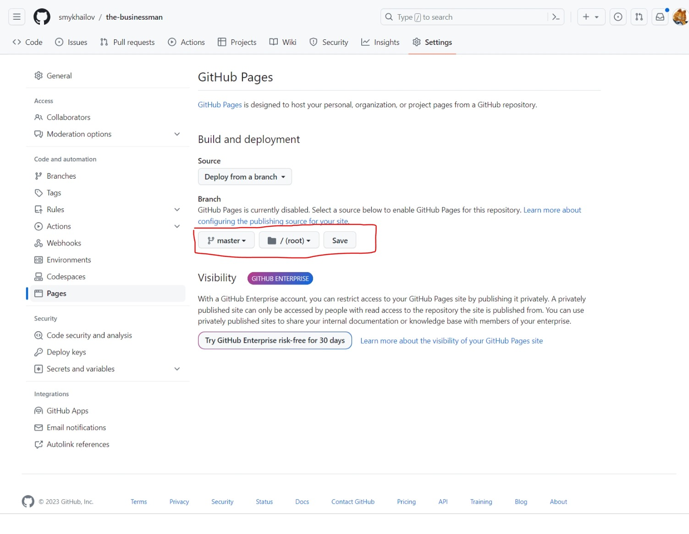
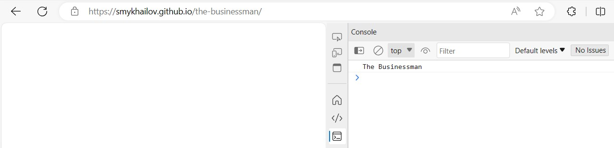

In this blog post, I will show you how to deploy your site to [GitHub Pages](https://docs.github.com/en/pages)
from the branch.

GitHub Pages is a service that lets you host your static website for free using GitHub.
You can use any branch in your repository as the source for your site, which gives you more flexibility
and control over your deployment process.

As I don't use any framework, I don't need to create a special branch for GitHub Pages.
I can use the `master` branch as the source for this project. For this project it is enough
to use [GitHub Settings](https://github.com/smykhailov/the-businessman/settings/pages) to publish the site.

Just select the `master` branch and click on the `Save` button. It is as easy as that.
You will see a message that says "Your site is ready to be published at https://username.github.io/reponame/"
where username is your GitHub username and reponame is your repository name.

In my case it is located on [The Businssman](https://smykhailov.github.io/the-businessman/) repository page.
For now, it is empty, but it will be updated as soon as I push the changes to the `master` branch. But as I referenced
JavaScript file which writes to console, we can open browser Dev Tools and see that message in the console.

Behind the scene GitHub Pages uses [Jekyll](https://jekyllrb.com/) to build your site. And creates [GitHub Actions workflow](https://github.com/smykhailov/the-businessman/actions/workflows/pages/pages-build-deployment),
which executes everytime the change is pushed to the `master` branch.

In the next artecle I will create the main screen for our game.
