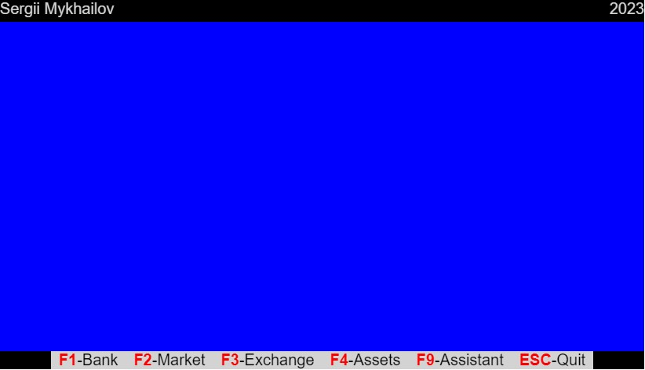
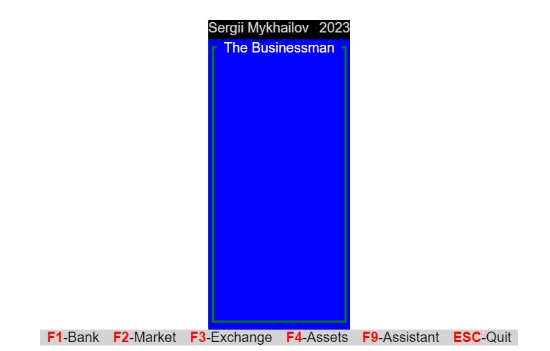

After we configured [project publishing](/articles/publish-to-github-pages), we can start working on the main screen.
The main screen is the first screen that the player sees when starts the game. The main screen will replicate the MS DOS
version of the game, but using [HTML](/articles/html-minimum-required-knowledge) and [CSS](/articles/css-minimum-required-knowledge).
The final result will look like it is shown on the cover picture of this article.

We are going to use Flexbox to position the elements on the screen. There is a great
[Flexbox guide](https://css-tricks.com/snippets/css/a-guide-to-flexbox/) on CSS-Tricks that you can use as a reference.
There is no reason for me to repeat the information already available and well explained. BTW, this is my general advice,
just go and read additional information, by following the links I provide or use search engines or StackOverflow
to get more information. ChatGPT is also good source of information, but it is not always very accurate and you need
to validate answers by yourself, if something doesn't work.

## The Main Screen

Usually each web site or even web page has a header, a footer and a main content. And our game is not going to be an exception to this.
So, the first, let's prepare the generic and very basic layout for it. We are going to use the following HTML code for it:

{/* prettier-ignore-start */}
```html {numberLines}
<!DOCTYPE html>
<html lang="en">
  <head>
    <meta charset="UTF-8" />
    <meta name="viewport" content="width=device-width, initial-scale=1.0" />
    <title>The Businessman</title>
    <link rel="stylesheet" href="css/styles.css" />
  </head>
  <body>
    <div id="wrapper">
      <div id="container">
        <header>

        </header> <!-- header -->
        <main>

        </main> <!-- main -->
        <footer>

        </footer> <!-- footer -->
      </div>  <!-- container -->
    </div>  <!-- wrapper -->
    <script src="js/main.js"></script>
  </body>
</html>
```
{/* prettier-ignore-end */}

And position elements with Flexbox:

```css {numberLines}
html,
body {
  height: 100%;
  margin: 0;
  padding: 0;
  width: 100%;
  color: lightgrey;
  font-family: "Roboto", sans-serif;
  font-size: 20px;
}

#wrapper {
  display: flex;
  flex-direction: column;
  justify-content: start;
  align-items: center;
  height: 100%;
}

#container {
  background-color: black;
  margin-top: 50px;
}

header {
  display: flex;
  justify-content: space-between;
  margin-bottom: 4px;
  font-size: medium;
}

footer {
  display: flex;
  justify-content: center;
  background-color: lightgray;
  margin: 0 52px;
}

main {
  display: flex;
  height: 320px;
}
```

Now, we can add header and footer content. The header will contain the author name and the current date.
The footer will contain the action buttons.

{/* prettier-ignore-start */}
```html {numberLines, diff}
...
<header>
  <div>Sergii Mykhailov</div>
  <div>2023</div>
</header>
- <main>
+ <main class="window-wrapper primary-bg">

</main>
<footer>
  <div><span>F1</span>-Bank</div>
  <div><span>F2</span>-Market</div>
  <div><span>F3</span>-Exchange</div>
  <div><span>F4</span>-Assets</div>
  <div><span>F9</span>-Assistant</div>
  <div><span>ESC</span>-Quit</div>
</footer>
...
```
{/* prettier-ignore-end */}

Also, let's add some style to it:

```css {numberLines}
.primary-bg {
  background-color: blue;
}

.window-wrapper {
  padding: 8px 4px;
}

footer > div {
  margin: 0 8px;
  font-size: medium;
  color: black;
}

footer > div > span {
  color: red;
  font-weight: bold;
}
```

At this point of time, our main screen should look like:



The great thing about CSS claases is, that we can reuse and combine them. The first example is shown on the `main` tag.
I use `window-wrapper` class to create a style for **any** window and will reuse this class for other windows,
after it I use `primary-bg` to **detalize** it with the background color.

We have two types of the window with two lines frame and one line frame. We are going to use the same technique to style them.

## Main window

Let's create Main window, this is a window on which we will see the other ones.

_Note:_ The concept of "window" I've taken from the Pascal/C++ terminology used in 80s and 90s. So, it is not the same window as in modern Windows, MacOS or Linux applications.

{/* prettier-ignore-start */}
```html {numberLines}
<main class="window-wrapper primary-bg">
  <div class="window single-line-green">
    <div class="title">
      The Businessman
    </div>
    <!-- The other windows will be placed here -->
    </div>
  </div> <!-- window -->
</main> <!-- main -->
```
{/* prettier-ignore-end */}

and corresponding CSS:

```css {numberLines}
.window {
  display: flex;
  flex-direction: column;
  padding: 4px 3px;
}

.window > .title {
  display: flex;
  align-self: center;
  color: white;
  position: relative;
  top: -14px;
  background-color: blue;
  padding: 0 8px;
  font-size: 16px;
}

.single-line-green {
  border: medium solid green;
}
```

After adding main window to our main screen it should look like:



The screen is very narrow, but it will be resized by the content, which will be placed insibe it. So no need to specify
the width manually in this case.

## Other windows

Applying the same approach, we can create the other three windows. In this article I'll show only the code for the one of it,
and the entire code available in the [GitHub repository](https://github.com/smykhailov/the-businessman/tree/v0.2) under v0.2 tag,
which we learned how to create in one of the previous articles - [The Businessman - Initial commit](/articles/the-businessman-initial-commit/#create-git-tag). Because we already configured automatic publishing,
after code is pushed to `master` branch, it automatically publishes to the GitHub Pages and available on [The Businessman](https://smykhailov.github.io/the-businessman/) page.

{/* prettier-ignore-start */}
```html {numberLines}
<main class="window-wrapper primary-bg">
  ...
  <div class="window-wrapper secondary-bg window-shadow">
    <div class="window secondary-bg double-line-black text-color-black">
      <div class="window-content">
        <p>Today: 05/21/2023</p>
        <p>Friday</p>
      </div>
    </div>
  </div>
  ...
</main>
```
{/* prettier-ignore-end */}

in the full version, you can find the way to position windows on the two columns. Flexbox technique used for it too.

## Summary

In this article we've created the main screen for our game. We've used Flexbox to position the elements on the screen.
But, there is no any interactivity, and everything is static. That's fine for now, in the next article we will add some [basic
interactivity](/articles/the-businessman-basic-interactivity), we will use JavaScript for it. After that we will start working on the other screens.
