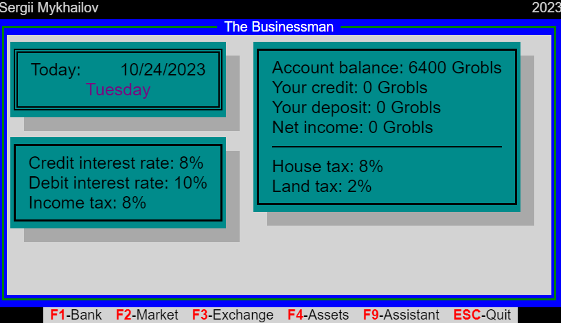

After we have created the basic structure of the game, we can start adding some interactivity to it. We will start with the most basic one, which is the main game loop.
Our requirement is to have a game loop that will run every two seconds and will update the game state. JavaScript has `setInterval` function, which we can use to achieve this.

```javascript {numberLines}
setInterval(() => {
  // update game state
}, 2000);
```

The first thing we need to display and increment the current game on every state update.
For that we can use a variable called `today` and increment it on every state update.

```javascript {numberLines}
const today = new Date();

setInterval(() => {
  const currentDate = today.toLocaleDateString("en-US");
  const dayOfWeek = today.toLocaleDateString("en-US", { weekday: "long" });

  const todayDateElement = document.getElementById("today-date");
  const todayDayOfWeekElement = document.getElementById("today-day-of-week");

  todayDateElement.innerText = currentDate;
  todayDayOfWeekElement.innerText = dayOfWeek;

  today.setDate(today.getDate() + 1);
}, 2000);
```

Next we add some colors to the day of week element, so it is easier to distinguish the days.

```javascript {numberLines}
...
setInterval(() => {
  ...

  if (dayOfWeekNum === 0) {
      todayDayOfWeekElement.classList.add('sunday');
  } else if (dayOfWeekNum === 6) {
      todayDayOfWeekElement.classList.add('saturday');
  } else {
      todayDayOfWeekElement.classList.remove('sunday');
      todayDayOfWeekElement.classList.remove('saturday');
  }

  today.setDate(today.getDate() + 1);
}, 2000);
```

```css {numberLines}
.today {
  display: flex;
  justify-content: space-between;
}

.day-of-week {
  display: flex;
  justify-content: center;
  color: purple;
}

.sunday {
  color: brown;
  text-transform: uppercase;
}

.saturday {
  color: brown;
}

.weekday {
  color: black;
}
```

And now we can see that the game is updating its current date every two seconds, with different styles for week days and weekends.


Now its time to add initial account balances and tax rates to the game. We will use `Math.random()` function to generate random numbers for the initial account balances and tax rates.

`creditInterestRate` and `debitInterestRate` will be between 5% and 15% and `incomeTax` will be between 1% and 10%.

```javascript {numberLines}
...
var creditInterestRate = Math.random() * 10 + 5;
var debitInterestRate = Math.random() * 10 + 5;
var incomeTax = Math.random() * 9 + 1;
...

setInterval(() => {
  ...
  const creditInterestRateElement = document.getElementById('credit-interest-rate');
  const debitInterestRateElement = document.getElementById('debit-interest-rate');
  const incomeTaxElement = document.getElementById('income-tax');

  creditInterestRateElement.innerText = creditInterestRate.toFixed(0);
  debitInterestRateElement.innerText = debitInterestRate.toFixed(0);
  incomeTaxElement.innerText = incomeTax.toFixed(0);
  ...
}, 2000);
```

The same way we can add initial account balances and other tax rates. I'm not going to post the entire code here, as it is available on [GitHub](https://github.com/smykhailov/the-businessman/releases/tag/v0.3).

The final result should look something like on the image below.



If you look into the final code you will see that adding more and more functionality will lead us very quickly to the point where the code will become very hard to maintain.
We will fix this in the next article, where I'll introduce you to [basic refactoring techniquies](/articles/the-businessman-basics-of-refactoring/).
