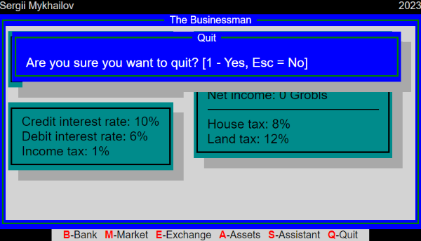
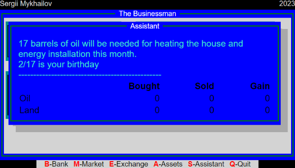
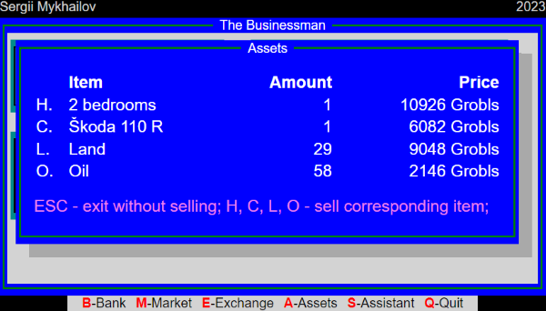
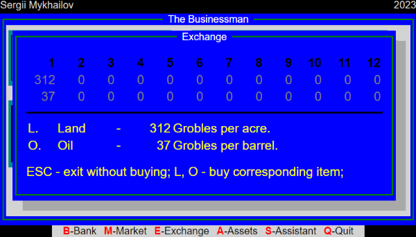
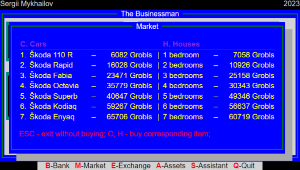
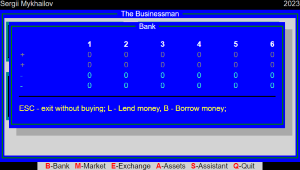

After [event handling](/articles/the-businessman-events-handling) has been implemented and we got ability to open empty dialogs, it's time to add some content to them.

We have to implement six dialogs:

- [Bank](#bank)
- [Market](#market)
- [Exchange](#exchange)
- [Assets](#assets)
- [Assistant](#assistant)
- [Quit](#quit)

I decided to go from last to first, because the last one is the easiest to implement. And we can reuse it's code for other dialogs.

## Quit

[The Quit dialog](https://github.com/smykhailov/the-businessman/releases/tag/v0.6)

## Assistant

[The Assistant dialog](https://github.com/smykhailov/the-businessman/releases/tag/v0.7)

## Assets

[The Assets dialog](https://github.com/smykhailov/the-businessman/releases/tag/v0.8)

## Exchange

[The Exchange dialog](https://github.com/smykhailov/the-businessman/releases/tag/v0.9)

## Market

[The Market dialog](https://github.com/smykhailov/the-businessman/releases/tag/v0.10)

## Bank

[The Bank dialog](https://github.com/smykhailov/the-businessman/releases/tag/v0.11)
