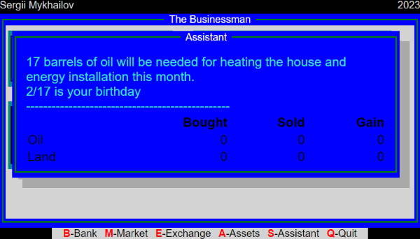

After [event handling](/articles/the-businessman-events-handling) has been implemented and we got ability to open empty dialogs, it's time to add some content to them.

We have to implement six dialogs:

- [Quit](#quit)
- [Assistant](#assistant)
- [Assets](#assets)
- [Exchange](#exchange)
- [Market](#market)
- [Bank](#bank)

I decided to go from last to first, because the last one is the easiest to implement. And we can reuse it's code for other dialogs.

## Quit


To implement the Quit dialog we need to add only few lines of HTML and CSS, as in prevous article we already implemented the dialog itself.

{/* prettier-ignore-start */}
```html {numberLines: 128, diff}
<div id="quit-main" class="modal hidden">
+   <div class="window-wrapper primary-bg window-shadow">
    <div class="window single-line-green">
      <div class="title">Quit</div>
+         <div class="window-content text-center text-color-white">
+           Are you sure you want to quit? [1 - Yes, Esc = No]
        </div>
      </div>
    </div>
  </div>
</div>  <!-- quit-main -->
```
{/* prettier-ignore-end */}

Only two classes added to the CSS, the good thing is that they are generic and could be reused later in other dialogs too.

```css {numberLines: 88}
.text-color-white {
  color: white;
}

.text-center {
  text-align: center;
}
```

To make Quit dialog functional, we need to implement `startGame` functinality firs, to restart the game, when quit the current.
To do it, we need to wrapp our init logic into the function, and call it on the game start and restart.

```javascript {numberLines}
let currentGameHandler = null;

const startNewGame = () => {
  const today = new Date();

  const interestRates = {
    debitInterestRate: Math.random() * 10 + 5,
    incomeTax: Math.random() * 9 + 1,
    creditInterestRate: Math.random() * 10 + 5,
  };

  const accountBalances = {
    accountBalance: Math.random() * 10000 + 1000,
    creditBalance: 0,
    depositBalance: 0,
    netIncome: 0,
  };

  const taxes = {
    houseTax: Math.random() * 19 + 1,
    landTax: Math.random() * 19 + 1,
  };

  setMainMenuMouseActions();
  setMainMenuKeyboardActions();

  setQuitWindowEventHandlers();

  if (currentGameHandler) {
    clearInterval(currentGameHandler);
  }

  currentGameHandler = setInterval(() => {
    setTodayView(today);
    setInterestRates(interestRates);
    setAccountsBalance(accountBalances);
    setTaxes(taxes);

    today.setDate(today.getDate() + 1);
  }, 2000);
};
```

And add keyboard event handler to the Quit dialog. And start the game.

```javascript {numberLines: 186}
const setQuitWindowEventHandlers = () => {
  document.addEventListener("keyup", e => {
    const quitWindow = document.getElementById("quit-main");

    if (quitWindow.classList.contains("hidden")) {
      return;
    }

    if (e.key === "1") {
      quitWindow.classList.add("hidden");
      startNewGame();
    }
  });
};

startNewGame();
```

That's it, we have implemented [the Quit dialog](https://github.com/smykhailov/the-businessman/releases/tag/v0.6).

## Assistant



The assistant dialog is very similar to the Quit dialog, but we need to add table and some initial data.

{/* prettier-ignore-start */}
```html {numberLines: 116}
<div id="assistant-main" class="modal hidden">
  <div class="window-wrapper primary-bg window-shadow text-color-black">
    <div class="window single-line-green">
      <div class="title">
        Assistant
      </div>
      <div class="window-content">
        <div class="text-color-turquoise">
          <p><span id="oil-to-heat-house"></span> barrels of oil will be needed for heating the house and energy installation this month.</p>
          <p><span id="birthday"></span> is your birthday</p>
          <p>------------------------------------------------</p>
        </div>

        <div class="text-color-black">
          <table>
            <thead>
              <tr>
                <th></th>
                <th>Bought</th>
                <th>Sold</th>
                <th>Gain</th>
              </tr>
            </thead>
            <tbody>
              <tr>
                <td>Oil</td>
                <td id="oil-bought-this-month">0</td>
                <td id="oil-sold-this-month">0</td>
                <td id="oil-gain">0</td>
              </tr>
              <tr>
                <td>Land</td>
                <td id="land-bought-this-month">0</td>
                <td id="land-sold-this-month">0</td>
                <td id="land-gain">0</td>
              </tr>
            </tbody>
          </table>
        </div>
      </div> <!-- window-content -->
    </div>
  </div>
</div> <!-- assistant-main -->
```
{/* prettier-ignore-end */}

Also we need to add a few lines of CSS to make the table look nice.

{/* prettier-ignore-start */}
```css {numberLines: 24}
table {
  width: 100%;
}

table th:not(:first-child),
table td:not(:first-child) {
  text-align: right;
}

.text-color-turquoise { /*L102*/
  color: turquoise;
}
```
{/* prettier-ignore-end */}

And the last thing is to add the data to the table.

{/* prettier-ignore-start */}
```javascript {numberLines: 24}
const assistantData = {
  oilToHeatHouse: Math.random() * 29  1,
  birthday: `${(Math.random() * 11  1).toFixed(0)}/${(Math.random() * 27  1).toFixed(0)}`
}

setAssistantData(assistantData); //L44

const setAssistantData = (data) => {  //L79
  setElementData('oil-to-heat-house', data.oilToHeatHouse.toFixed(0));
  setElementData('birthday', data.birthday);
}
```
{/* prettier-ignore-end */}

And [the Assistant dialog](https://github.com/smykhailov/the-businessman/releases/tag/v0.7) dialog is done too.

## Assets


The Assets dialog is almost the same as the Assistant dialog, but we need to add more data, which we also will reuse for the Market dialog.

{/* prettier-ignore-start */}
```html {numberLines: 104}
<div id="assets-main" class="modal hidden">
  <div class="window-wrapper primary-bg window-shadow text-color-black">
    <div class="window single-line-green">
      <div class="title">
        Assets
      </div>
      <div class="window-content">
        <div class="text-color-white">
          <table>
            <thead>
              <tr>
                <th></th>
                <th class="text-left">Item</th>
                <th>Amount</th>
                <th>Price</th>
              </tr>
            </thead>
            <tbody>
              <tr>
                <td>H.</td>
                <td id="owned-house" class="text-left"></td>
                <td id="owned-house-amount">1</td>
                <td id="owned-house-price"></td>
              </tr>
              <tr>
                <td>C.</td>
                <td id="owned-car" class="text-left"></td>
                <td id="owned-car-amount">1</td>
                <td id="owned-car-price"></td>
              </tr>
              <tr>
                <td>L.</td>
                <td id="owned-land" class="text-left">Land</td>
                <td id="owned-land-amount"></td>
                <td id="owned-land-price"></td>
              </tr>
              <tr>
                <td>O.</td>
                <td id="owned-oil" class="text-left">Oil</td>
                <td id="owned-oil-amount"></td>
                <td id="owned-oil-price"></td>
              </tr>
            </tbody>
          </table>
        </div>

        <div class="wide-line text-color-violet">
          <p>ESC - exit without selling; H, C, L, O - sell corresponding item;</p>
        </div>
      </div> <!-- window-content -->
    </div>
  </div>
</div> <!-- assets-main -->
```
{/* prettier-ignore-end */}

A little more CSS styles, which, again, will be reused for other dialogs too.

{/* prettier-ignore-start */}
```css {numberLines: 105}
.text-color-violet {
  color: violet;
}

.text-left { /*L113*/
  text-align: left !important;
}

.wide-line {  /*L203*/
  margin: 16px 0px;
}
```
{/* prettier-ignore-end */}

And some data, which, as I mentioned, we will reuse for the Market dialog too.

{/* prettier-ignore-start */}
```javascript {numberLines: 29}
const availableHouses = [{
  name: '1 bedroom',
  price: Math.round(Math.random() * 5000 + 5000),
}, {
  name: '2 bedrooms',
  price: Math.round(Math.random() * 10000 + 10000),
}, {
  name: '3 bedrooms',
  price: Math.round(Math.random() * 10000 + 20000),
}, {
  name: '4 bedrooms',
  price: Math.round(Math.random() * 10000 + 30000),
}, {
  name: '5 bedrooms',
  price: Math.round(Math.random() * 10000 + 40000),
}, {
  name: '6 bedrooms',
  price: Math.round(Math.random() * 10000 + 50000),
}, {
  name: '7 bedrooms',
  price: Math.round(Math.random() * 10000 + 60000),
}];

const availableCars = [{
  name: 'Škoda 110 R',
  price: Math.round(Math.random() * 5000 + 5000),
}, {
  name: 'Škoda Rapid',
  price: Math.round(Math.random() * 10000 + 10000),
}, {
  name: 'Škoda Fabia',
  price: Math.round(Math.random() * 10000 + 20000),
}, {
  name: 'Škoda Octavia',
  price: Math.round(Math.random() * 10000 + 30000),
}, {
  name: 'Škoda Superb',
  price: Math.round(Math.random() * 10000 + 40000),
}, {
  name: 'Škoda Kodiaq',
  price: Math.round(Math.random() * 10000 + 50000),
}, {
  name: 'Škoda Enyaq',
  price:Math.round(Math.random() * 10000 + 60000),
}];

const exchangePrices = {
  land: Math.round(Math.random() * 300 + 100),
  oil: Math.round(Math.random() * 30+ 10)
}

const assets = {
  house: availableHouses[Math.round(Math.random() * 6)],
  car: availableCars[Math.round(Math.random() * 6)],
  land: {
    amount: Math.round(Math.random() * 95 + 5),
    currentMonthPrice: exchangePrices.land,
  },
  oil: {
    amount: Math.round(Math.random() * 250 + 10),
    currentMonthPrice: exchangePrices.oil,
  }
}
```
{/* prettier-ignore-end */}

Also we need to display these data in the dialog.

{/* prettier-ignore-start */}
```javascript {numberLines: 108}
setAssets(assets);

const setAssets = (assets) => {  //L149
  setElementData('owned-house', assets.house.name);
  setElementData('owned-house-price', `${assets.house.price} Grobls`);
  setElementData('owned-car', assets.car.name);
  setElementData('owned-car-price', `${assets.car.price} Grobls`);

  setElementData('owned-land-amount', assets.land.amount);
  setElementData('owned-land-price', `${assets.land.amount * assets.land.currentMonthPrice} Grobls`);
  setElementData('owned-oil-amount', assets.oil.amount);
  setElementData('owned-oil-price', `${assets.oil.amount * assets.oil.currentMonthPrice} Grobls`);
}
```
{/* prettier-ignore-end */}

And [the Assets dialog](https://github.com/smykhailov/the-businessman/releases/tag/v0.8) is implemented too.

## Exchange


No big difference to previous dialogs for Exchane one, just a little bit more code.

{/* prettier-ignore-start */}
```html {numberLines: 92}
<div id="exchange-main" class="modal hidden">
  <div class="window-wrapper primary-bg window-shadow text-color-black">
    <div class="window single-line-green">
      <div class="title">
        Exchange
      </div>
      <div class="window-content">
        <table class="table-fixed">
          <thead>
            <tr>
              <th>1</th>
              <th>2</th>
              <th>3</th>
              <th>4</th>
              <th>5</th>
              <th>6</th>
              <th>7</th>
              <th>8</th>
              <th>9</th>
              <th>10</th>
              <th>11</th>
              <th>12</th>
            </tr>
          </thead>
          <tbody>
            <tr class="text-color-grey">
              <td id="land-price-1">0</td>
              <td id="land-price-2">0</td>
              <td id="land-price-3">0</td>
              <td id="land-price-4">0</td>
              <td id="land-price-5">0</td>
              <td id="land-price-6">0</td>
              <td id="land-price-7">0</td>
              <td id="land-price-8">0</td>
              <td id="land-price-9">0</td>
              <td id="land-price-10">0</td>
              <td id="land-price-11">0</td>
              <td id="land-price-12">0</td>
            </tr>
            <tr class="text-color-grey">
              <td id="oil-price-1">0</td>
              <td id="oil-price-2">0</td>
              <td id="oil-price-3">0</td>
              <td id="oil-price-4">0</td>
              <td id="oil-price-5">0</td>
              <td id="oil-price-6">0</td>
              <td id="oil-price-7">0</td>
              <td id="oil-price-8">0</td>
              <td id="oil-price-9">0</td>
              <td id="oil-price-10">0</td>
              <td id="oil-price-11">0</td>
              <td id="oil-price-12">0</td>
            </tr>
          </tbody>
        </table>

        <hr />

        <table class="text-color-yellow">
          <tr>
            <td class="text-left">L.</td>
            <td class="text-left">Land</td>
            <td class="text-left"> - </td>
            <td id="exchange-land-price">0</td>
            <td class="text-left"> Grobles per acre.</td>
          </tr>
          <tr>
            <td class="text-left">O.</td>
            <td class="text-left">Oil</td>
            <td class="text-left"> - </td>
            <td id="exchange-oil-price">0</td>
            <td class="text-left"> Grobles per barrel.</td>
          </tr>
        </table>
        <p class="wide-line text-color-yellow">ESC - exit without buying; L, O - buy corresponding item;</p>
      </div> <!-- window-content -->
    </div>
  </div>
</div> <!-- exchange-main -->
```
{/* prettier-ignore-end */}

Few more CSS classes.

{/* prettier-ignore-start */}
```css {numberLines: 109}
.text-color-grey {
  color: grey;
}

.text-color-yellow {
  color: yellow;
}

.table-fixed { /*L213*/
  table-layout: fixed;
  width: 100%;
  text-align: right !important;
}
```
{/* prettier-ignore-end */}

{/* prettier-ignore-start */}
```javascript {numberLines: 75, diff}
-const exchangePrices
+const currentMonthExchangePrices

const historicalExchangePrices = [ //L80
  // HACK: this is temporary, this logic will be changed, when we implement end of month logic
  {
    land: currentMonthExchangePrices.land,
    oil: currentMonthExchangePrices.oil,
  },
  { land: 0, oil: 0 },
  { land: 0, oil: 0 },
  { land: 0, oil: 0 },
  { land: 0, oil: 0 },
  { land: 0, oil: 0 },
  { land: 0, oil: 0 },
  { land: 0, oil: 0 },
  { land: 0, oil: 0 },
  { land: 0, oil: 0 },
  { land: 0, oil: 0 },
  { land: 0, oil: 0 },
];

const assets = {
  house: availableHouses[Math.round(Math.random() * 6)],
  car: availableCars[Math.round(Math.random() * 6)],
  land: {
    amount: Math.round(Math.random() * 95 + 5),
-     currentMonthPrice: exchangePrices.land,
+     currentMonthPrice: currentMonthExchangePrices.land,
  },
  oil: {
    amount: Math.round(Math.random() * 250 + 10),
-     currentMonthPrice: exchangePrices.oil,
+     currentMonthPrice: currentMonthExchangePrices.oil,
  },
};

setAssets(assets);  //L125
setExchangePrices(currentMonthExchangePrices, historicalExchangePrices);
```
{/* prettier-ignore-end */}

And let's display the data in the dialog.

{/* prettier-ignore-start */}
```javascript {numberLines: 178}
const setExchangePrices = (exchangeCurrentMonthPrices, historicalExchangePrices) => {
  setElementData('exchange-land-price', exchangeCurrentMonthPrices.land);
  setElementData('exchange-oil-price', exchangeCurrentMonthPrices.oil);

  for (let i = 1; i < historicalExchangePrices.length + 1; i++) {
    // Arrays are zero based, but we start from 1 and need to subtract 1
    const historicalExchangePrice = historicalExchangePrices[i - 1];

    const landPriceElement = document.getElementById(`land-price-${i}`);
    const oilPriceElement = document.getElementById(`oil-price-${i}`);

    landPriceElement.innerText = historicalExchangePrice.land;
    oilPriceElement.innerText = historicalExchangePrice.oil;
  }
}
```
{/* prettier-ignore-end */}

And we are done with [the Exchange dialog](https://github.com/smykhailov/the-businessman/releases/tag/v0.9).

## Market


As we've already implemented a lot of dialogs, the Market dialog is the same easy to implement.

{/* prettier-ignore-start */}
```html {numberLines: 80}
<div id="market-main" class="modal hidden">
  <div class="window-wrapper primary-bg window-shadow text-color-black">
    <div class="window single-line-green">
      <div class="title">
        Market
      </div>
      <div class="window-content">
        <table class="market-table">
          <thead>
            <tr>
              <th class="text-left" colspan="5">C. Cars</th>
              <th class="text-left" colspan="3">H. Houses</th>
            </tr>
          </thead>
          <tbody>
            <tr>
              <td>1. </td>
              <td class="text-left" id="car-1"></td>
              <td>–</td>
              <td id="car-price-1"></td>
              <td>&nbsp;|&nbsp;</td>
              <td class="text-left" id="house-1"></td>
              <td>–</td>
              <td id="house-price-1"></td>
            </tr>
            <tr>
              <td>2. </td>
              <td class="text-left" id="car-2"></td>
              <td>–</td>
              <td id="car-price-2"></td>
              <td>&nbsp;|&nbsp;</td>
              <td class="text-left" id="house-2"></td>
              <td>–</td>
              <td id="house-price-2"></td>
            </tr>
            <tr>
              <td>3. </td>
              <td class="text-left" id="car-3"></td>
              <td>–</td>
              <td id="car-price-3"></td>
              <td>&nbsp;|&nbsp;</td>
              <td class="text-left" id="house-3"></td>
              <td>–</td>
              <td id="house-price-3"></td>
            </tr>
            <tr>
              <td>4. </td>
              <td class="text-left" id="car-4"></td>
              <td>–</td>
              <td id="car-price-4"></td>
              <td>&nbsp;|&nbsp;</td>
              <td class="text-left" id="house-4"></td>
              <td>–</td>
              <td id="house-price-4"></td>
            </tr>
            <tr>
              <td>5. </td>
              <td class="text-left" id="car-5"></td>
              <td>–</td>
              <td id="car-price-5"></td>
              <td>&nbsp;|&nbsp;</td>
              <td class="text-left" id="house-5"></td>
              <td>–</td>
              <td id="house-price-5"></td>
            </tr>
            <tr>
              <td>6. </td>
              <td class="text-left" id="car-6"></td>
              <td>–</td>
              <td id="car-price-6"></td>
              <td>&nbsp;|&nbsp;</td>
              <td class="text-left" id="house-6"></td>
              <td>–</td>
              <td id="house-price-6"></td>
            </tr>
            <tr>
              <td>7. </td>
              <td class="text-left" id="car-7"></td>
              <td>–</td>
              <td id="car-price-7"></td>
              <td>&nbsp;|&nbsp;</td>
              <td class="text-left" id="house-7"></td>
              <td>–</td>
              <td id="house-price-7"></td>
            </tr>
          </tbody>
        </table>
        <p class="wide-line text-smaller text-color-red">ESC - exit without buying; C, H - buy corresponding item;</p>
      </div>
    </div>
  </div>
</div> <!-- market-main -->
```
{/* prettier-ignore-end */}

Few more colors and table styles. Market dialog has bigger height, so we need to adjast the top position.

{/* prettier-ignore-start */}
```css {numberLines: 117, diff}
.text-color-red {
  color: red;
}

.text-smaller {
  font-size: smaller;
}

.modal {  /*L212*/
  position: absolute;
-   top: 20px;
+   top: 0;
  width: calc(660px - 20px);
-   height: calc(378px - 100px);
+   height: calc(378px - 50px);
  z-index: 100;
  padding: 100px 0 0 20px;
}

.market-table { /*L227*/
  font-size: smaller;
}

.market-table th {
  color: blueviolet;
  border-bottom: 1px solid blueviolet;
}

.market-table td {
  color: yellow;
}
```
{/* prettier-ignore-end */}

And we need to set data to display in the dialog.

{/* prettier-ignore-start */}
```javascript {numberLines: 127}
setMarketData(availableCars, availableHouses);

const setMarketData = (cars, houses) => {  //L195
  for (let i = 1; i < cars.length + 1; i++) {
    const car = cars[i - 1];

    const carNameElement = document.getElementById(`car-${i}`);
    const carPriceElement = document.getElementById(`car-price-${i}`);

    carNameElement.innerText = car.name;
    carPriceElement.innerText = `${car.price} Grobls`;
  }

  for (let i = 1; i < houses.length + 1; i++) {
    const house = houses[i - 1];

    const houseNameElement = document.getElementById(`house-${i}`);
    const housePriceElement = document.getElementById(`house-price-${i}`);

    houseNameElement.innerText = house.name;
    housePriceElement.innerText = `${house.price} Grobls`;
  }
}
```
{/* prettier-ignore-end */}

[The Market dialog](https://github.com/smykhailov/the-businessman/releases/tag/v0.10) is done.

## Bank


The Bank dialog is the easiest on, as we don't need to add any data to it.
And we already have all CSS styles defined, we can just reuse all we need for this dialog.

{/* prettier-ignore-start */}
```html {numberLines: 68}
<div id="bank-main" class="modal hidden">
  <div class="window-wrapper primary-bg window-shadow text-color-black">
    <div class="window single-line-green">
      <div class="title">
        Bank
      </div>
      <div class="window-content">
        <table class="table-fixed text-smaller">
          <thead>
            <tr class="text-color-white">
              <th></th>
              <th>1</th>
              <th>2</th>
              <th>3</th>
              <th>4</th>
              <th>5</th>
              <th>6</th>
            </tr>
          </thead>
          <tbody>
            <tr class="text-color-grey">
              <td class="text-left">+</td>
              <td id="credit-1-1">0</td>
              <td id="credit-1-2">0</td>
              <td id="credit-1-3">0</td>
              <td id="credit-1-4">0</td>
              <td id="credit-1-5">0</td>
              <td id="credit-1-6">0</td>
            </tr>
            <tr class="text-color-grey">
              <td class="text-left">+</td>
              <td id="credit-2-1">0</td>
              <td id="credit-2-2">0</td>
              <td id="credit-2-3">0</td>
              <td id="credit-2-4">0</td>
              <td id="credit-2-5">0</td>
              <td id="credit-2-6">0</td>
            </tr>
            <tr class="text-color-turquoise">
              <td class="text-left">-</td>
              <td id="debit-1-1">0</td>
              <td id="debit-1-2">0</td>
              <td id="debit-1-3">0</td>
              <td id="debit-1-4">0</td>
              <td id="debit-1-5">0</td>
              <td id="debit-1-6">0</td>
            </tr>
            <tr class="text-color-turquoise">
              <td class="text-left">-</td>
              <td id="debit-2-1">0</td>
              <td id="debit-2-2">0</td>
              <td id="debit-2-3">0</td>
              <td id="debit-2-4">0</td>
              <td id="debit-2-5">0</td>
              <td id="debit-2-6">0</td>
            </tr>
          </tbody>
        </table>

        <hr />

        <p class="wide-line text-smaller text-color-yellow">ESC - exit without buying; L - Lend money, B - Borrow money;</p>
      </div>
    </div>
  </div>
</div> <!-- bank-main -->
```
{/* prettier-ignore-end */}

The last [Bank dialog](https://github.com/smykhailov/the-businessman/releases/tag/v0.11) id done as well.

In the next articles we will implement the game logic and the game will be playable. We will start with adding logic to each of the dialogs.
